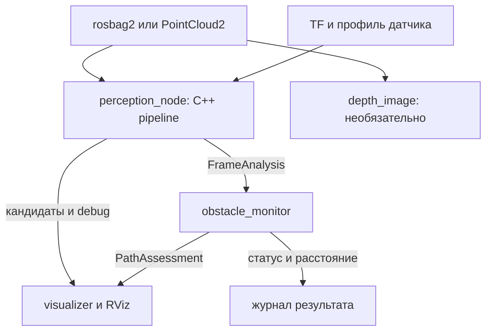
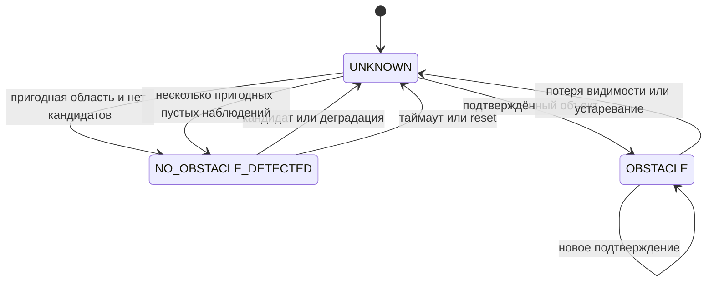

# Metro Perception — план и состояние

**Обновлено:** 26 сентября 2026 года. **База:** `feature/data-analysis`, `f13e569`.
Дедлайн сдачи — 29.09 23:59 МСК. Запуск, алгоритм и результаты — в [README.md](README.md).
Старый план ниже в `<details>` — историческая справка, его статусы не действуют.

## 1. Состояние задач

| ID | Статус | Доказательство и предел |
|---|---|---|
| D1 | Закрыта | Bag организаторов сверены (SHA-256, поля, частота): `evaluation/dataset.yaml`, `scripts/audit_bags.py`. |
| D2 | Закрыта | Разметка `evaluation/annotations/`, `splits.yaml`: development/validation по bag, `new_data` — 595 с development и слепая часть, `cloud_with_fake_obj` — регрессия. Разметка синтетики не оценивает кадры, где вставленный объект виден слабее 10 возвратов. |
| G1 | Закрыта | RANSAC-пол с опорой по дальности, головка рельса по высоте установки 1,075 м. |
| G2 | Закрыта | Габарит 2,1 × 3,0 м, каналы MOTION/GAUGE, ось по стенам со сглаживанием, полоса неопределённости у края, колонны и длинные боковые конструкции. 26.09: 0 ложных кадров на пяти пустых записях, 26 в `new_data` (было 528). |
| G3 | Закрыта | `FrameAnalysis → PathAssessment`, сессии, stale; «свободно» при ASSUMED по решению владельца (26.09), область не короче 50 м. |
| G4 | Закрыта | Треки 2/3, дальше 70 м — 4/5, на ходу нужен GAUGE, снятие подтверждения при уходе к краю. |
| Q1 | Закрыта | Метрики `quality.json`, чистый прогон `results/final-f13e569` (`run_reproducible: true`). |
| Q2 | Закрыта для проверенного онлайн-сценария | Причины: QoS (`0f13d10`) и сборка runtime-образа без Release (исправлено 26.09). На `cloud_with_fake_obj` при 1×: анализ 10 Гц, возраст результата ~44 мс, 8 из 290 кадров перезаписано. Офлайн на ненагруженной машине (`results/final-ba69723-idle`) p95 ≤ 58 мс на всех записях; в `new_data` редкие серии 100–130 мс в разных местах от прогона к прогону. Хвосты 350–600 мс в `final-f13e569` — артефакт параллельной нагрузки при замере. |
| V1 | Закрыта | `perception.launch.py rviz:=true`: depth-видео слева, облако справа; серый — дальность, зелёный — коридор, красный — препятствие; габарит коридора — четыре тонкие продольные линии; под depth-видео — панель RViz с текстом `assessment` (`metro_perception_rviz`); depth-видео 10 Гц. Проверено на `runtime-desktop` под Xvfb с GPU. |
| V2 | Закрыта | CI (lint, пакеты, runtime без сети, desktop); 174 теста пакетов (colcon), 51 pytest скриптов, 9 smoke. Образы экспортируются для стенда без интернета (`scripts/export_images.sh`). |
| V3 | Частично | README и план обновлены; видео нового вида RViz записаны (`results/demo/fake_obj_rviz.mp4`, 45 с; `results/demo/doubleT_obstacle_rviz_v2.mp4`, 22 с); архивы образов — `results/images/`. Осталось: слайды 7–11 по шаблону, выложить видео и образы на диск, публичный репозиторий. |

## 2. Итог по критериям задания

| Критерий | Состояние |
|---|---|
| Качество обнаружения | 0 ложных кадров на пяти пустых записях; `new_data` — 26/5 950 и 16/5 321 (слепая часть). Синтетика организаторов: 0 тревог на объектах вне габарита, 6 из 7 объектов в габарите найдены. |
| Дальность | Проверенная область 65–75 м; первое обнаружение: короб 2×2 — 64 м, человек — 54–67 м, куб 0,3 м — 33–43 м. 100 м не достигнуто: расширение даёт ложные тревоги на новых данных. |
| Скорость | Офлайн p50 24–48 мс, p95 ≤ 58 мс (README, `results/final-ba69723-idle`); онлайн на `cloud_with_fake_obj` при 1×: 10 Гц, ~44 мс. GPU не нужен. |
| Инженерия | Тесты, CI, воспроизводимые прогоны с хешами, Docker без сети во время работы, документация. |

## 3. Остаток работы

1. Презентация: обязательные слайды 7–11 по шаблону, архитектура, алгоритм, эксперименты,
   ограничения.
2. Выложить архивы образов (`results/images/`) и видео на диск, сделать репозиторий публичным,
   влить `feature/data-analysis` в `main` до 29.09 23:59. После дедлайна не пушить.
3. После сдачи (если попадём в финал): ось пути по рельсам (код есть, `rail_route_weight`),
   дальность 100 м без роста ложных тревог, короб у края габарита.

## 4. Неподвижные контракты

1. Состояния `UNKNOWN`, `OBSTACLE`, `NO_OBSTACLE_DETECTED`. `OBSTACLE` — только подтверждённый
   трек с конечной положительной дальностью; неподтверждённые кандидаты и кандидаты с меткой
   `EDGE` дают UNKNOWN.
2. «Свободно» при ASSUMED — только при проверенной области не короче 50 м и отсутствии
   кандидатов; при потере входа, пола или TF — UNKNOWN.
3. Нет дальности — NaN и `distance_valid=false`, не ноль.
4. Stale очищает объекты и треки, но сохраняет ключ наблюдения.
5. Время bag — для разметки, `header.stamp` — для TF, монотонные часы — для сторожевого таймера.
6. Профиль выбирается по типу сенсора, никогда по имени bag.

## 5. Протокол эксперимента

Любое изменение детектора проверяется:
- на пяти пустых записях;
- на разработочной части `new_data`;
- на синтетике организаторов (включая объекты вне габарита);
- на нашей синтетике (`scripts/inject_obstacle.py`).

Проверки сравниваются с предыдущей версией по кадрам и первому обнаружению. Слепая часть
`new_data` смотрится только итогом. Её смотрели при выборе итоговых версий 26.09, поэтому как
независимая проверка она ослаблена. Итоговый прогон — `scripts/evaluate_in_container.sh` на
чистом checkout.

---

<a id="историческая-версия-плана"></a>

<details>
<summary>Историческая версия плана до актуализации 23.09.2026 — справка, не действующий график</summary>

# Metro Perception — анализ ветки, архитектура и план завершения

**Дата анализа:** 20 сентября 2026 года.  
**Репозиторий:** [VladObradovich/metro-lidar-processing](https://github.com/VladObradovich/metro-lidar-processing).  
**Проверенная ветка:** `feature/docker`.  
**Снимок:** [`ccebc7f98bb3eb554651dd129347ad26d8788cc0`](https://github.com/VladObradovich/metro-lidar-processing/commit/ccebc7f98bb3eb554651dd129347ad26d8788cc0), `add multi-stage build`, 20.09.2026, 13:21:57 UTC.  
**Сравнение:** на момент чтения ветка на 6 коммитов впереди `main` (`9f345728a7881d2da8cd3421d94b55beea59adee`), отставания нет.  
**Горизонт:** 5 рабочих дней, 5 участников: 3 разработчика и 2 тестировщика.

Это новый план, основанный на фактическом состоянии указанного коммита, приложенном `PLAN.md` и задании Дептранспорта. Предлагаемые файлы, сообщения, параметры и команды ниже ещё предстоит реализовать, если явно не сказано обратное. Анализ не изменяет репозиторий.

**Содержание**

- [1. Главный вывод](#1-главный-вывод)
- [2. Что уже сделано в feature/docker](#2-что-уже-сделано-в-featuredocker)
- [3. На какие ROS 2 проекты опирается архитектура](#3-на-какие-ros-2-проекты-опирается-архитектура)
- [4. Архитектура пакетов и процессов](#4-архитектура-пакетов-и-процессов)
- [5. Контракты данных, координат и времени](#5-контракты-данных-координат-и-времени)
- [6. Архитектура алгоритма](#6-архитектура-алгоритма)
- [7. Проверка качества и работа двух тестировщиков](#7-проверка-качества-и-работа-двух-тестировщиков)
- [8. Производительность и доработка упаковки](#8-производительность-и-доработка-упаковки)
- [9. Новый список оставшихся работ](#9-новый-список-оставшихся-работ)
- [10. Риски, критерии завершения и сокращение объёма](#10-риски-критерии-завершения-и-сокращение-объёма)
- [11. Первичные источники и привязка к коду](#11-первичные-источники-и-привязка-к-коду)
- [12. План на 5 дней для 5 человек](#12-план-на-5-дней-для-5-человек)

## 1. Главный вывод

Инфраструктура разработки и запуска уже значительно подготовлена. Главная недостающая часть проекта — собственно обнаружение препятствий: вычислительное ядро, геометрия пути, результат с расстоянием, обработка неопределённости и доказательство качества на записях.

**Рекомендуемая архитектура на пять дней:** пять ROS-пакетов, одно независимое C++-ядро обработки, одна тяжёлая нода `perception_node`, отдельный лёгкий `obstacle_monitor`, необязательные визуализация и существующий `depth_image`.

**Рекомендуемый алгоритм:** геометрическое обнаружение объектов, пересекающих предполагаемый габарит движения: проверка входа → координаты → локальная поверхность пути → коридор → точки вне поверхности → кластеры → проверка на исходных точках → расстояние → временное подтверждение. Ограничения геометрии и наблюдаемости выдаются явно.

Это наиболее практичный выбор при текущем коде, сроке и составе команды. Он не является доказанно лучшим алгоритмом для этих данных: это можно установить только сравнением на исходных bag. К концу второго дня должна работать полная цепочка; третий день отводится улучшениям, четвёртый — измерениям и заморозке, пятый — приёмке и сдаче.

### 1.1. Основания и границы достоверности

| Источник | Что действительно проверено | Что из этого нельзя заключать |
|---|---|---|
| GitHub, указанный SHA | Дерево из 40 файлов, исходники ноды, Dockerfile, Compose, launch, README, тесты; сравнение с main; API Actions | Сам факт наличия кода не доказывает успешный запуск образа на стенде |
| Приложенный `PLAN.md` | Полностью прочитаны архитектура, сведения о данных, интерфейсы и семидневный план | Указанные в нём измерения bag не были повторены здесь |
| `5_ДепТранспорта.md` | Требования к Humble/Ubuntu/Docker, демонстрации, дальности, метрикам и сдаче | Оценки 100/200/300 м не означают, что эти дальности уже достигнуты |
| Шесть MP4 | Проверены длительности/разрешения, просмотрены представительные кадры всех шести роликов | Видео не заменяет PointCloud2, калибровку и разметку объектов в метрах |
| Локальные проверки | 7 существующих unittest масштаба прошли; воспроизведён дефект чтения `row_step` | Полная ROS-сборка, pytest-набор и работа контейнера не проверены |
| Публичные проекты | Прочитаны первичные документы Autoware и исходники Nav2/MoveIt 2 для Humble | Современные API Autoware нельзя считать совместимыми с Humble без проверки |

В среде анализа нет Docker, colcon, установленного ROS и pytest. Поэтому здесь нет результатов `colcon test`, полной сборки Docker, реального rosbag replay или измерений FPS. Исходных `.db3`/`.mcap` среди приложений нет; в Git лежат только служебные файлы каталога `rosbags/`.

### 1.2. Что требует задание

Обязательная среда: **Ubuntu 22.04 + ROS 2 Humble + Docker**. Стенд: Intel Core i7-9700E, 8 ядер, 2.60 GHz; 128 GiB RAM; RTX 4070 Ti SUPER. GPU допустим, но не обязателен.

Обязательный результат: запуск контейнера, чтение неизвестного заранее bag, обнаружение препятствия и расстояния, понятная визуализация, исходники, README, архитектура, описание алгоритма, результаты экспериментов и короткое видео. Все зависимости устанавливаются при сборке.

Основные критерии — пропуски, ложные тревоги, дальность, скорость и обобщение на неизвестные проезды. Поэтому увеличение числа ROS-нод, внедрение lifecycle само по себе или доработка внешнего вида контейнера не заменяют прогресса по детектору.

## 2. Что уже сделано в feature/docker

### 2.1. Подтверждённое состояние

| Подсистема | Состояние | Основание в снимке | Остаток работы |
|---|---|---|---|
| Ubuntu / ROS | В Docker используется `ros:humble-ros-base` | `docker/Dockerfile`, `docker/Dockerfile.runtime` | Чистая сборка и исполнение на целевом стенде |
| Devcontainer | Есть `universal` и `desktop`, `/ws`, UID-подстройка VS Code | `.devcontainer/*/devcontainer.json` | Регрессия Linux/WSL2, не создавать заново |
| Runtime | Есть builder, runtime, runtime-desktop, копирование install | `docker/Dockerfile.runtime` | Включить новые пакеты и их runtime-зависимости |
| Headless Compose | Есть отдельный сервис local | `compose.local.yaml` | Автоматизированный конечный сценарий запуска детектора |
| Desktop Compose | Есть desktop и обёртка запуска | `compose.yaml`, `scripts/desktop.sh` | Проверка на реальных Linux/WSLg; NVIDIA отдельно |
| X11 / масштаб | Прокси, обработка отсутствующего дисплея, масштаб Qt | `.devcontainer/scripts/`, `docker/gui-env.sh` | Адресная регрессия, особенно WSLg и Snap Docker |
| Данные и результаты | `/data` read-only, `/results` для вывода | Compose, Dockerfile, dockerignore | Проверить UID и произвольный внешний путь |
| ROS-пакеты | Уже есть tools и bringup | `metro_perception_tools`, `metro_perception_bringup` | Добавить core, interfaces, ros с рабочим поведением |
| Изображение глубины | Python-нода, проекция по azimuth/ring, раскраска, MP4 | `depth_image.py` | Исправить вход/время; сохранить как вспомогательный инструмент |
| RViz | Есть конфигурация для облака и изображения | `depth_image.rviz`, launch | Добавить коридор, объекты, расстояние, статус |
| Сборка/тесты | Есть build.sh, test.sh, unit-тесты, runtime smoke | `scripts/`, `test_depth_projection.py` | Тесты детектора и интеграции пока отсутствуют |
| CI | Workflow-файлов в дереве нет; Actions API вернул 0 запусков | Дерево и Actions API | Добавить автоматическую сборку и тесты |
| Детектор | Не реализован | README прямо сообщает об этом; кода детектора нет | Основной объём разработки |
| Экспериментальная оценка | Нет dataset/splits/annotations/evaluator | Дерево репозитория | Подготовить измеримый процесс проверки |

**Важное обновление относительно прошлых обсуждений:** стандартный запуск вне VS Code уже появился. Есть `compose.local.yaml`, `compose.yaml` и `bash scripts/desktop.sh up`. Повторно планировать «создать Compose с нуля» не нужно.

### 2.2. Точные замечания по коду

#### A. Неверное чтение организованных облаков с padding между строками

`point_cloud_xyz_ring()` создаёт плоское представление длиной `width * height` с шагом `point_step`, игнорируя `row_step`. Это работает только при подходящем плотном расположении строк.

Воспроизведение на двух строках по одной точке: `point_step=14`, `row_step=16`. Ожидались X `[1.0, 4.0]`, ring `[7, 7]`; функция вернула X `[1.0, 0.0]`, ring `[7, 16448]`. Это подтверждённый дефект универсального чтения, а не предположение о конкретных предоставленных bag.

**Действие:** для существующей визуализации учесть двумерные strides; для C++-адаптера адрес точки вычислять как `row * row_step + column * point_step`. Добавить регрессионный тест до изменения реализации.

#### B. Текущая нода требует ring и FLOAT32

Это допустимое ограничение конкретной проекции, но его нельзя наследовать обязательному детектору. Его минимальный вход — XYZ. `ring`, `intensity`, индивидуальное время точки — дополнительные признаки. Поддержать XYZ FLOAT32/FLOAT64 и оба порядка байтов; неподдерживаемые форматы завершать контролируемой ошибкой кадра.

**Действие:** собственный универсальный адаптер и явная диагностика отсутствующих/неверных полей. Если ring отсутствует, детектор продолжает работу, а ring-панорама отключается с объяснением либо использует отдельно настроенную угловую проекцию.

#### C. QoS входа жёстко RELIABLE

В `DepthImageNode` вход имеет RELIABLE и depth=4. Подписчик с таким профилем не получает данные от best-effort publisher [R6]. Это риск интеграции с неизвестным источником, а не доказанная неисправность текущего bag.

**Действие:** настраиваемый QoS, live-профиль best effort / volatile / keep-last 1; отдельная проверка replay. Для данных без потерь нужен последовательный evaluator, а не обещание, что RELIABLE никогда не пропускает кадры на уровне приложения.

#### D. Видео записывается в callback, большие скачки времени не ограничены

`_write_video_frame()` заполняет временной разрыв копиями последнего кадра через цикл. Большой скачок `header.stamp` может вызвать длительную запись дубликатов. При перемотке назад нода не начинает новую видеосессию автоматически.

**Действие:** ограничить допустимый gap, разбивать запись на сессии при скачках, вынести тяжёлый вывод из callback или оставлять его только во вспомогательной отдельной ноде. Измерять алгоритм с видео и без него.

#### E. Строки панорамы привязаны к min/max ring текущего кадра

Если крайние каналы отсутствуют, остальные могут сместиться по вертикали. Это потенциальный источник мерцания изображения, не подтверждённый на приложенных bag.

**Действие:** фиксированная карта каналов из профиля датчика; неизвестные значения ring учитывать отдельно. Не использовать цвета MP4 или номера строк такой панорамы как метрическую разметку.

#### F. Образ пока собирает только два существующих пакета

В builder явно перечислены tools и bringup. После добавления core/interfaces/ros одного создания каталогов недостаточно: Dockerfile должен копировать их манифесты и исходники. В runtime зависимости перечислены вручную и пока отражают Python-визуализацию.

**Действие:** обновить сборку и полный набор exec-зависимостей; проверить запуск C++-узла в чистом runtime, а не только в devcontainer, где PCL/Eigen уже установлены. Риск: build проходит, но в готовом образе не хватает shared library или ROS-пакета.

#### G. Desktop и NVIDIA — разные задачи

`desktop.sh` автоматически добавляет `/dev/dri` и render group через `docker/compose.gpu.yaml`. Это не настройка NVIDIA Container Toolkit, CUDA или доступа к NVIDIA GPU. RViz и алгоритм по умолчанию не должны требовать GPU.

**Действие:** обязательный CPU/headless путь; отдельно тест desktop на доступной графике. NVIDIA-профиль добавлять только при реальной необходимости и проверять на машине с NVIDIA. Наличие RTX на стенде само по себе не повод переписывать ядро на CUDA.

#### H. Приёмочный smoke проверяет визуализацию

`scripts/smoke_runtime.py` ждёт пять непустых изображений и проверяет читаемость MP4. Он полезен, но не проверяет наличие препятствия, правильное расстояние, UNKNOWN, геометрию и задержку.

**Действие:** сохранить этот smoke и добавить отдельную проверку perception, включая отрицательные и ошибочные входы.

#### I. Разделение процессов и контейнеров пока требует явной настройки

По умолчанию заданы `ROS_LOCALHOST_ONLY=1` и domain 42. Для bag и узлов в одном контейнере это соответствует простому сценарию. Обмен с другим контейнером или внешним лидаром нельзя считать работающим автоматически.

**Действие:** на сдаче держать player и узлы в одном контейнере. Внешнюю ROS-сеть вынести в отдельную инструкцию и тест; включать только при необходимости.

### 2.3. Что изменилось относительно старого PLAN.md

| Старый пункт | Обновление |
|---|---|
| Перевести Jazzy на Humble | Docker и инструкции уже на Humble; остаётся проверка |
| Перенести `metro_lidar_processing` в новую структуру | Старого пакета уже нет; tools/bringup созданы |
| Создать контейнер, runtime entrypoint и Compose | Уже есть; доработать под новые пакеты и конечный запуск |
| Создать пять пакетов сразу | Два существуют; три новых добавлять с реализацией |
| Preprocessor и detector — отдельные lifecycle-компоненты | На срок 5 дней объединить тяжёлый тракт внутри perception; классы оставить отдельными |
| Lifecycle как обязательная часть сдачи | Перенести из P0; контролируемый старт/сброс/остановку обеспечить обычными нодами |
| Семидневный график | Перепланировать на 5 дней с тестированием с первого дня |
| Геометрия, адаптация к дальности, UNKNOWN, общий evaluator | Сохранить как основу, но разделить обязательную версию и улучшения |
| Отложенный bag | Сохранить только если он ещё не использовался для настройки; иначе назвать регрессией |
| Создавать сложную инфраструктуру заранее | Не требуется; приоритет — обнаружение и воспроизводимость |

## 3. На какие ROS 2 проекты опирается архитектура

### 3.1. Что именно заимствуем

| Проект | Проверенная практика | Применение здесь | Что не переносим |
|---|---|---|---|
| Autoware Universe | Разделение preprocessing, ground segmentation, clustering; параметры и входы/выходы модулей [R1–R3] | Отдельные классы обработки, явные контракты, диагностические выходы | Весь стек автопилота, карту дорог, автомобильные классы и многочисленные зависимости |
| Autoware.Auto | Отдельные алгоритмический модуль и ROS-обвязка; адаптация соседства к дальности [R4] | Core отдельно от ROS; сравнение фиксированного и адаптивного clustering | Буквальное копирование 2D-кластеризации: в тоннеле важна высота |
| Nav2 Humble | `nav2_bringup`, общие YAML, namespace/remapping, варианты standalone/composition [R5] | Отдельный bringup, единый params file и понятные launch-аргументы | Навигационные серверы, behavior tree, lifecycle manager как обязательную зависимость |
| MoveIt 2 Humble | Core-библиотеки можно применять независимо от ROS-узлов; в проекте допускаются ROS messages [R7] | Наше ядро сделать ещё строже: собственные C++-типы, без rclcpp и ROS-msg | Планировщики манипуляторов, scene server и pluginlib без потребности |
| ROS 2 Humble | Совместимость QoS, ограниченные очереди, composable nodes [R6, R8] | Настраиваемые QoS, небольшой backlog, отдельные измерения времени | Утверждение, будто composition автоматически даёт zero-copy на всём пути |

Используем структурные принципы. Финальный набор библиотек и API проверяется сборкой именно на Humble. Ссылки `main/latest` Autoware — архитектурные материалы, а не обещание готовых Humble-пакетов.

### 3.2. Сравнение вариантов

| Вариант | Срок разработки | Копии/обмен | Удобство тестов | Главный риск | Решение |
|---|---|---|---|---|---|
| Одна большая Python-нода с алгоритмом, GUI и видео | Быстрый первый эскиз | Мало ROS-переходов, но дорогие операции и блокировка callback возможны | Сложнее изолировать причины ошибки | Производительность и смешение обязанностей | Сохранить Python для вспомогательных задач |
| Каждая операция — отдельная ROS-нода | Большой объём launch/синхронизации | Много больших сообщений | Изоляция есть, интеграция сложнее | Не успеть собрать рабочую цепочку | Не выбирать |
| Исходная схема preprocessor → detector → monitor | Разумна для более долгого развития | Как минимум дополнительная граница большого облака | Хорошая | Лишний контракт и жизненный цикл на срок 5 дней | Возможное развитие после сдачи |
| C++ core + perception + monitor + отдельная визуализация | Умеренный | Облако декодируется один раз; далее компактный результат | Ядро проверяется без ROS | Нужно дисциплинированно держать границу ядра | **Выбранный вариант** |
| Полная интеграция Autoware | Высокий | Зависит от графа | Есть готовые подходы | Форматы, версии, карты, зависимости | Использовать как источник решений |
| ML/аномалии изображения глубины | Нужны обучение и независимая проверка | Зависит от модели | Требует достаточной разметки | Мало подтверждённых положительных примеров | P2 после геометрического baseline |

Цена выбранного упрощения: отдельно перезапустить только preprocessing нельзя. На пятидневном горизонте это приемлемо; математические части по-прежнему тестируются и заменяются отдельно.

## 4. Архитектура пакетов и процессов

### 4.1. Пять пакетов

| Пакет | Сборка | Содержимое | Зависимости |
|---|---|---|---|
| `metro_perception_core` | ament_cmake, C++17 | Типы, фильтрация, ground, corridor, clustering, distance, temporal logic | STL, Eigen, необходимые части PCL; без ROS runtime |
| `metro_perception_interfaces` | ament_cmake + rosidl | Небольшие пользовательские сообщения результата | std_msgs, geometry_msgs, vision_msgs, builtin_interfaces |
| `metro_perception_ros` | ament_cmake, C++17 | PointCloud2/TF adapters, perception, monitor, RViz markers, evaluate_bag | core, interfaces, rclcpp, tf2, rosbag2_cpp и сообщения |
| `metro_perception_bringup` | Существующий ament_cmake | Launch, параметры, профили датчиков, RViz | ros, tools, launch; optional RViz описать явно |
| `metro_perception_tools` | Существующий ament_python | Depth image, inspect, annotations helper, metrics, reports | rclpy/rosbag2_py по необходимости, NumPy/OpenCV |

Core остаётся ROS-пакетом для colcon/rosdep, но его библиотечный API не использует ROS. Это позволяет вызывать одну реализацию из онлайн-ноды и последовательного evaluator.

### 4.2. Рабочий граф



`perception_node` и `obstacle_monitor` — два обязательных процесса. Визуализатор и depth_image можно полностью отключить. Player для сдачи запускается в том же Docker-контейнере, но отдельным процессом.

Разделение мониторинга и вычислений нужно для наблюдаемой причины: если тяжёлое вычисление зависло, отдельный монитор всё ещё может выдать `UNKNOWN / PROCESSING_TIMEOUT`. Это не делает систему отказоустойчивой при падении всего контейнера; внешний потребитель также должен проверять свежесть результата.

### 4.3. Внутреннее устройство perception_node

| Класс | Обязанность | Чего в нём не должно быть |
|---|---|---|
| `PointCloudAdapter` | Валидация PointCloud2 и создание компактного кадра | Поиск препятствий, жёсткий формат 26 байт |
| `TransformProvider` | Получение преобразования на время измерения, проверка доступности | Неявная подмена на latest TF |
| `Preprocessor` | Маска датчика, диапазон, конечность координат, выборки | Семантические исключения по bag |
| `GroundEstimator` | Локальная опорная поверхность и качество по участкам | Удаление всех больших плоскостей |
| `CorridorEstimator` | Габарит вокруг прямой/оценённой линии пути и пригодная область | Автоматическое угадывание ветки стрелки |
| `CandidateExtractor` | Подписанная высота, пересечение коридора, неопределённые зоны | Отбрасывание неизвестного как свободного |
| `Clusterer` | Компоненты связности по пространственной близости | Классификатор «только человек» |
| `ObjectValidator` | Поддержка сырыми точками, bbox, расстояние, причины отказа | Требование одинаковой плотности на любой дальности |
| `PerceptionPipeline` | Порядок стадий, переиспользование памяти, единый результат | ROS publisher, файлы видео, sleep |
| `PerceptionNode` | QoS, очередь, worker, параметры, диагностика, публикация | Копия формул из core |

Входной callback только принимает указатель на сообщение, фиксирует порядковый номер/время приёма и заменяет ожидающий кадр. Вычисления выполняет один worker; одновременно обрабатывается максимум один кадр и ожидает максимум один следующий. TF/таймеры не должны блокироваться этим worker.

Геометрия внутри одного кадра вычисляется последовательно. Многопоточность PCL/OpenMP добавляется только по результатам профиля; восемь потоков на каждую стадию по умолчанию могут ухудшить общую задержку.

### 4.4. API ядра

Ниже эскиз контракта, а не готовые заголовочные файлы:

```cpp
struct PointXYZ { float x, y, z; };
struct FrameContext {
  uint64_t frame_sequence;
  int64_t measurement_time_ns;
  // sensor_origin, configuration_id, session identity
};
struct FrameInput {
  std::vector<PointXYZ> points;
  FrameContext context;
};
struct FrameResult {
  std::vector<ObstacleCandidate> candidates;
  std::vector<CorridorSegment> corridor;
  CoverageAssessment coverage;
  StageTimings timings;
  AnalysisStatus status;
};

class PerceptionPipeline {
 public:
  explicit PerceptionPipeline(const AlgorithmConfig& config);
  FrameResult process(const FrameInput& frame);
  void reset();
};

class TemporalMonitor {
 public:
  Assessment update(const FrameResult& frame, int64_t measurement_time_ns);
  Assessment on_timeout();
  void reset();
};
```

В C++17 не использовать `std::span` без отдельной совместимой реализации. Для первого варианта достаточно ссылки на vector и индексов. Данные ring/intensity добавлять опциональными массивами только там, где используются. Core не читает YAML: ROS/evaluator преобразуют конфигурацию в проверенные структуры.

### 4.5. Размещение файлов

Не нужно перемещать уже работающие пакеты ещё раз. Репозиторий сохраняется в корне обычного workspace либо как checkout внутри `<workspace>/src/`.

| Каталог | Новые файлы/группы |
|---|---|
| `metro_perception_core/include/metro_perception_core/` | `types.hpp`, `config.hpp`, `pipeline.hpp`, `ground_estimator.hpp`, `corridor_estimator.hpp`, `clusterer.hpp`, `temporal_monitor.hpp` |
| `metro_perception_core/src/` | Реализации этих стадий, preprocessing, object validation |
| `metro_perception_core/test/` | Геометрические fixtures, clustering, distance, temporal tests |
| `metro_perception_interfaces/msg/` | `ObstacleCandidate.msg`, `CorridorSegment.msg`, `FrameAnalysis.msg`, `PathAssessment.msg` |
| `metro_perception_ros/src/` | `pointcloud_adapter.cpp`, `perception_node.cpp`, `obstacle_monitor_node.cpp`, `visualizer_node.cpp`, `evaluate_bag.cpp`, тонкие main-файлы |
| `metro_perception_ros/test/` | Адаптер, QoS, TF, launch и reset tests |
| `metro_perception_bringup/launch/` | `perception.launch.py`, `demo.launch.py`; старый `depth_image.launch.py` сохранить |
| `metro_perception_bringup/config/` | `algorithm.yaml`, `runtime.yaml`, `sensors/*.yaml`, `vehicle.yaml`, при необходимости `qos_overrides.yaml` |
| `metro_perception_bringup/rviz/` | `perception.rviz` |
| `metro_perception_tools/metro_perception_tools/` | `inspect_bag.py`, `metrics.py`, `report.py`; существующий depth_image |
| `evaluation/` | `dataset.yaml`, `splits.yaml`, `annotations/`, описание формата и наборов |
| `docs/` | Архитектура, алгоритм, экспериментальные результаты, демонстрация |
| `.github/workflows/` | Один workflow сборки/тестов на Humble |

Зависимости экспортировать через корректные CMake targets, `ament_export_*` и package.xml. Параметры/launch устанавливать в `share/<package>`, искать через ament index. Не открывать config относительно текущей рабочей директории.

### 4.6. Composition и lifecycle

**P0:** обычные `rclcpp::Node`, standalone-запуск, явная готовность, reset, завершение worker и ограниченные очереди. Конструктор perception принимает `rclcpp::NodeOptions`, алгоритм уже отделён от main.

**P1:** зарегистрировать perception как `rclcpp_components` component и проверить standalone/composed варианты с одинаковыми параметрами. Для единственной тяжёлой ноды ожидаемый выигрыш composition невелик: основные промежуточные данные уже остаются в памяти core.

**После сдачи:** lifecycle имеет смысл при необходимости штатных configure/activate/deactivate, управляемой перенастройки и внешнего supervisor. Тогда запрещать новую работу на deactivate, отменять результаты предыдущей сессии и проверять все переходы. Не внедрять непроверенный lifecycle в четвёртый или пятый день ради сходства с Nav2.

## 5. Контракты данных, координат и времени

### 5.1. Входной адаптер

Обязательные проверки до чтения координат:

1. Поля `x/y/z` существуют, имеют поддерживаемый datatype и скалярный count=1.
2. `point_step` ненулевой; каждое поле целиком помещается внутри точки.
3. Умножения размеров проверены на переполнение; размеры не превышают заданного лимита.
4. `row_step >= width * point_step`; буфера хватает на все заявленные строки.
5. Адрес каждой точки учитывает `row_step`; `is_bigendian` учитывается для каждого числового поля.
6. Невыровненные поля читаются через безопасное копирование байтов, без dereference невыровненного `float*`/`double*`.
7. Конечность проверяется независимо от `is_dense`.
8. Нулевые возвраты и ближняя маска проверяются в исходной системе лидара, до смещения в base frame. Нулевая точка после трансляции может стать ненулевой — порядок важен.
9. Пустой кадр — отдельный корректно обработанный случай, но не свидетельство свободного пути.
10. Некорректный кадр даёт диагностическую причину, не падение процесса.

Схему полей можно кэшировать по подписи `(fields, point_step, endian)`. Изменение схемы между кадрами инвалидирует кэш. Высота/ширина кадра и имя топика не выбирают алгоритм. Фиксированные 26 байт и offset timestamp=18 из старого плана используются только как один тестовый формат.

### 5.2. Системы координат и калибровка

Алгоритм работает в `base_link` или в явно описанной эквивалентной локальной системе: X вперёд, Y влево, Z вверх, метры. Название `base_link` само по себе не задаёт высоту пола и положение начала координат.

Профиль датчика содержит фактически проверенное преобразование `sensor_frame → target_frame`, положение центра лидара в target_frame, область собственного корпуса и доступный сектор обзора. По данным старого плана TF/IMU/odom отсутствуют — это нужно повторно проверить на bag.

Порядок получения калибровки:

1. `inspect_bag` фиксирует исходные frame_id и поля.
2. В RViz показываются оси; проверяются направление пути и знак вертикали.
3. Используются сведения организаторов о монтаже; если их нет, строится оценка с зафиксированной неопределённостью.
4. Результат проверяется на нескольких местах проезда, а не на одном кадре.
5. Профиль сохраняется в YAML с источником значений и датой проверки.
6. При отсутствии реального TF bringup может публиковать проверенное статическое преобразование. Если внешний TF уже есть, статический publisher отключается.

Сектор `-140°..-40°` у текущей панорамы указывает, что нельзя без проверки считать исходный X направлением движения. Для второго профиля панорама охватывает `-180°..180°`; это тоже не определяет ориентацию поезда.

Если доступен динамический TF, lookup выполняется на `header.stamp` с ограниченным ожиданием. Нельзя молча брать самый свежий TF для старого облака. При смене frame_id разрешено продолжить работу только при наличии согласованного преобразования; временную историю сбросить, если нарушилась её система отсчёта.

### 5.3. Дальность: фиксируем смысл числа

Основное публикуемое расстояние — **евклидова дальность от центра лидара до ближайшей принятой точки препятствия, пересекающей коридор**:

\[
 d_{\min}=\min_{p\in C_{accepted}\cap Corridor}\|p-o_{lidar}\|_2.
\]

Все величины берутся в одной системе координат. Если облако перенесено в base_link, использовать `sensor_origin` в base_link, а не считать `norm(p)` относительно произвольного начала base_link.

Для протяжённого объекта сохранять два разных значения, если они нужны: ближайшая точка всей обнаруженной формы и ближайшая точка её части внутри габарита. Основной `distance_m` относится ко второму определению; это избавляет от ситуации, когда боковая часть платформы становится «ближайшим препятствием на пути».

Расстояние уточняется на исходных очищенных точках, уже прошедших проверку принадлежности объекту. Расстояние до центра bbox систематически отличается от расстояния до поверхности. Квантиль можно выводить как вспомогательную устойчивую оценку, но нельзя называть его минимумом.

Продольная дистанция по оценённой линии пути — отдельная величина `path_distance_m`, только если линия пригодна. Дистанция от переднего габарита поезда — ещё одна величина и требует положения лидара относительно передней части. Ни одну из них не смешивать с тормозным путём.

### 5.4. Топики

Имена внутри нод относительные или private; окончательные имена устанавливает bringup. Ниже пример под namespace `/metro`.

| Топик | Тип | Кто публикует | Политика |
|---|---|---|---|
| Вход через remap `~/input/points` | `sensor_msgs/PointCloud2` | Внешний player/датчик | Live best effort, volatile, keep-last 1; настраиваемый |
| `/metro/perception/analysis` | `FrameAnalysis` | perception | Reliable, volatile, небольшая очередь, sequence check |
| `/metro/perception/detections` | `vision_msgs/Detection3DArray` | perception | Необязательный стандартный выход кандидатов |
| `/metro/assessment` | `PathAssessment` | monitor | Reliable, volatile, keep-last 1; периодический heartbeat |
| `/metro/markers` | `visualization_msgs/MarkerArray` | visualizer | Ограниченная частота, удаление старых marker ID |
| `/metro/debug/points` | `sensor_msgs/PointCloud2` | perception | Только по флагу и при подписчиках; прорежено |
| `/metro/diagnostics` | `diagnostic_msgs/DiagnosticArray` | perception/monitor | Например 1 Гц, независимо от тяжёлой стадии |
| Изображение глубины | `sensor_msgs/Image` | depth_image | Не входит в обязательную цепочку |

`FrameAnalysis` содержит всё необходимое для принятия решения. Monitor не собирает объекты, коридор и качество из нескольких несинхронизированных топиков. Стандартный `Detection3DArray` — дополнительная проекция данных, а не вторая версия истины.

Для `vision_msgs` проверить конкретный API Humble при реализации. Если семантической классификации нет, не выдумывать классы объектов и вероятность. Геометрическое качество — отдельный некалиброванный показатель, а не вероятность обнаружения.

### 5.5. Предлагаемые сообщения

Окончательные `.msg` фиксируются в первый день и собираются через rosidl. Ниже семантический контракт; допустимы другие имена полей при сохранении смысла.

**ObstacleCandidate**

| Поле | Смысл |
|---|---|
| `candidate_id` | ID внутри кадра; не обещает постоянный track ID |
| `bbox` | `vision_msgs/BoundingBox3D` в frame_id результата |
| `nearest_point` | Ближайшая принятая точка внутри коридора |
| `distance_m`, `distance_valid` | Дальность от лидара; невалидное число игнорируется |
| `support_points` | Число исходных точек после проверки |
| `support_rings` | Число различных каналов, если ring доступен; отдельно флаг наличия |
| `geometry_quality` | Документированная оценка поддержки, не вероятность |
| `reason_flags` | Причины сомнений: мало точек, граница коридора, модель поверхности и т.п. |

**CorridorSegment**

Продольные границы/опорные точки, ширина/высота, модель опорной поверхности, качество геометрии, качество наблюдаемости, причина непригодности. Можно передавать сэмплированную линию и параметры сечений; число сегментов ограничено конфигурацией.

**FrameAnalysis**

- `Header`: исходное время измерения, frame_id результата.
- `source_instance_id`: уникальный идентификатор запуска perception.
- `session_id`: растущий номер сессии внутри запуска; меняется при reset/скачке времени.
- `frame_sequence`: порядковый номер принятого кадра.
- `processing_status` и причины: OK, BAD_INPUT, TF_UNAVAILABLE, INVALID_GEOMETRY, OVERLOAD и т.д.
- Массив кандидатов и сегментов коридора.
- Флаг наличия пригодной области; её дальность/границы.
- `processing_age_ms`: время от приёма кадра perception до публикации; отдельно стадии и очередь.
- Числа полученных/обработанных/вытесненных/отклонённых кадров.

**PathAssessment**

- Тот же ключ исходного наблюдения; heartbeat не выдаётся за новое измерение.
- `state`: `OBSTACLE`, `NO_OBSTACLE_DETECTED`, `UNKNOWN`.
- Подтверждённые объекты, `distance_m`, `distance_valid`.
- Оценённая область и её качество; reasons.
- Возраст последнего результата, состояние потока, признак устаревания.
- Последнее обнаружение может храниться для UI отдельно как stale; оно не получает новый observation stamp.

Массивы и строки ограничить на уровне параметров/валидации. Если обработка обрезана по лимиту кандидатов, выставить причину деградации, а не молча считать оставшуюся область проверенной.

### 5.6. Три разных времени

| Время | Использование | Запрет |
|---|---|---|
| `header.stamp` | Время измерения, временная ассоциация, TF, ключ наблюдения | Не вычитать из системного времени без проверки общей шкалы |
| Timestamp записи bag | Порядок replay, связь с разметкой и исходной записью | Не считать автоматически равным времени лидара |
| Monotonic/steady time | Длительность вычислений, локальный watchdog, ожидание готовности | Не трактовать абсолютное значение как переносимый ROS timestamp |

Онлайн и offline должны использовать один и тот же источник времени для temporal logic. Основной вариант — `header.stamp`, если аудит подтверждает его пригодность. Если требуется исправление времени, нужен один общий адаптер для обоих режимов с сохранением исходных меток; не исправлять только evaluator.

`use_sim_time=true` задаётся согласованно для bag-демо с `/clock`, но не решает расхождение bag/header. Для чисто статического TF эта проблема проще, для динамического может блокировать lookup.

Watchdog работает по steady clock: при паузе replay `/clock` может остановиться, но статус всё равно должен стать UNKNOWN. В demo reason может называться `INPUT_PAUSED_OR_STOPPED`; по отсутствию сообщений нельзя отличить паузу от отказа сенсора без внешнего сигнала.

### 5.7. Очереди, свежесть и сессии

1. Callback увеличивает received counter, назначает sequence и сохраняет `ConstSharedPtr` сообщения.
2. Ожидающий слот заменяется новым кадром; вытеснение считается.
3. Worker забирает слот и делает обработку. Новый кадр не отменяет автоматически любой результат старого: иначе при перегрузке возможна бесконечная отмена без публикаций.
4. Перед публикацией проверяются session token и допустимый processing age. Старый результат после reset не публикуется.
5. Monitor принимает только возрастающие sequence текущего source/session. Запоздалый результат старой сессии отвергается.
6. Таймаут результата переводит статус в UNKNOWN, даже если сам процесс perception ещё жив.
7. Reset очищает pipeline state, temporal history и pending frame. Worker завершается/инвалидируется через generation token.
8. При завершении процесса: остановить приём, разбудить worker, дождаться его завершения с контролем, закрыть файлы.

Предлагаемый начальный watchdog для ожидаемых 10 Гц — 0,5 с; это **настройка для проверки**, а не свойство данных. Начальный лимит возраста результата, например 0,3 с, также проверяется на стенде. При постоянном превышении нужно снижать стоимость обработки и фиксировать UNKNOWN, а не скрывать backlog.

Нода может точно посчитать вытеснения своих кадров и ошибки обработки. Полное число потерянных DDS-сообщений по одному PointCloud2 без исходного sequence обычно неизвестно: интервалы timestamps дают только оценку. Для replay сравнивать число сообщений bag, число принятых callbacks и опубликованных результатов отдельно.

### 5.8. Логика monitor



Правила приоритета:

- Свежий подтверждённый объект с пригодной **локальной** геометрией → OBSTACLE. Плохая видимость дальше него не должна подавлять реальное обнаружение; дальняя область отдельно остаётся непригодной.
- Кандидат ещё не подтверждён → UNKNOWN с причиной `PENDING_CONFIRMATION`, кандидат показывается сразу.
- Нет кандидатов, вход/геометрия/наблюдаемость пригодны → NO_OBSTACLE_DETECTED только для указанной области.
- Некорректный вход, TF, недостаточная поддержка, устаревание → UNKNOWN.
- После исчезновения ранее подтверждённого объекта не переходить немедленно в «не обнаружено»: сначала требуются свежие пригодные наблюдения без объекта. Число/время задаются конфигурацией.

`NO_OBSTACLE_DETECTED` не является разрешением движения или гарантией отсутствия любого предмета. Это операционное описание результата выбранного детектора в ограниченной области.

## 6. Архитектура алгоритма

### 6.1. Почему геометрический baseline

Задание ориентировано на неизвестные объекты и небольшое число положительных примеров. Нет оснований ожидать, что обученный на одном проезде классификатор обобщится на новые препятствия. Геометрический подход можно быстро запустить, объяснить и проверить по стадиям.

Первый алгоритм не пытается распознать человека. Он ищет измеренные структуры, которые занимают предполагаемый габарит движения и не объясняются локальной поверхностью пути. Известные инфраструктурные элементы подавляются только при наличии геометрического основания, а не потому, что имеют знакомую форму или имя сцены.

### 6.2. Шаг 0 — обследование данных

`inspect_bag` должен сформировать паспорт каждой записи:

- topic, тип, число сообщений, storage backend, длительность, частота и интервалы;
- schema PointCloud2, dimensions, endian, row_step, point_step, диапазоны координат;
- доли конечных/нулевых точек, ring/intensity, наличие per-point time;
- уникальные frame_id и изменения схемы;
- начальные/конечные bag и header timestamps, распределение их разности;
- наличие `/tf`, `/tf_static`, odometry, IMU, `/clock`;
- размеры облаков, оценку нагрузки, контрольные суммы входных файлов.

Сведения из старого плана: 2488 облаков, около 4 минут 10 секунд, 307 200 или 921 600 точек, два топика, без odom/IMU/TF. **До повторной проверки это исходные гипотезы аудита.** Нельзя установить конкретную модель лидара только по имени `/hesai128/` и размеру массива.

### 6.3. Шаг 1 — очистка и область интереса

Удалить NaN/Inf, невалидные нулевые возвраты и точки собственного корпуса. Выполнить transform. Отобрать переднюю область по реальному направлению движения и первичному ограничению дальности.

До оценки коридора нельзя сразу оставить только узкую полосу между предполагаемыми рельсами: для оценки геометрии нужны боковые опорные точки. Использовать две маски:

- широкая **geometry ROI** для поверхности и ориентиров;
- более узкая **detection ROI** внутри предполагаемого габарита.

Сохранять исходные очищенные точки и индексы. Не применять глобальный StatisticalOutlierRemoval с жёстким k на всём облаке: он способен убрать редкую дальнюю цель. Любой noise filter проверяется отдельно по дальности.

### 6.4. Шаг 2 — два масштаба представления

Для построения поверхности использовать прореженную выборку; для проверки кандидатов и дальности — исходные точки. Кластеризация получает только точки, не объяснённые поверхностью, поэтому её нагрузка существенно меньше полного облака.

Начальные исследовательские настройки: voxel для геометрии порядка 0,1–0,2 м в ближней области, с ограниченной адаптацией дальше. Это не финальные параметры: реальная минимальная цель должна оставлять достаточное число точек. Не переносить `point_stride:=2` из команды визуализации в обязательный детектор автоматически.

Хранить связь voxel → исходные индексы или выполнять локальный поиск в исходном облаке вокруг кандидата. Выбрать один способ после первого профиля. Строить один пространственный индекс на нужной выборке и переиспользовать его, а не строить заново для каждого bbox.

### 6.5. Шаг 3 — опорная поверхность пути

**Baseline:** плоскость в нижней части geometry ROI, RANSAC с ограничением нормали относительно вертикали и ожидаемой высоты поверхности. Модель:

\[
 ax+by+cz+d=0,\qquad \|\mathbf n\|=1,\quad c>0.
\]

Проверять не только долю inliers, но и пространственную поддержку: сколько продольных участков и поперечных зон поддерживают модель. Тысяча точек маленькой платформы не должна заменять модель всего пути.

**Улучшение P1:** разбить путь на продольные участки и оценивать локальную поверхность `z_g(x,y)` с ограничением изменения высоты/уклона. Между поддержанными участками допустима ограниченная интерполяция; далеко за последней опорой — UNKNOWN.

Ключевые ограничения:

- Доминирующая стена не может стать полом: ограничение нормали и высотной области.
- Платформа выше путевой поверхности не принимается за неё только из-за размера.
- Верх препятствия не должен становиться опорной поверхностью: нижние seeds, проверка ожидаемой высоты, боковой поддержки и непрерывности.
- Шпалы и рельсы создают реальную неоднородность. Слишком толстый допуск «пол» удаляет низкие препятствия.
- Поперечная дверь/затвор не удаляется как большая плоскость: если она занимает габарит, это кандидат.
- Одна плоскость не описывает длинный профиль с переломами уклона. Это отмечено и в ограничениях RANSAC-фильтра Autoware [R2].

Хранить три категории: поверхность, достоверная точка над поверхностью, неопределённая точка. Неопределённые точки нельзя тихо выбросить и после этого сообщить, что область проверена.

### 6.6. Шаг 4 — коридор движения

Прямой baseline задаётся относительно локальной оси поезда. Габарит — не ширина колеи; нужны ширина/высота поезда и монтаж лидара. Если точные значения неизвестны, использовать документированную оценку и пометить её как источник неопределённости.

Для линии `c(s)`, бокового направления `n(s)` и вертикали можно задать область:

\[
 p=c(s)+u\,n(s)+v\,\hat z,\qquad
 |u|\le W/2+m_y(s),\quad
 h_{min}\le v\le H+m_z(s).
\]

Здесь `W,H` — выбранный габарит, `m_y,m_z` — допуски. Для кривой координата `s` относится к ближайшему участку линии. Класс corridor отвечает за это преобразование, чтобы кластеризация и visualizer не вычисляли его по-разному.

**Прямой режим обязателен.** Пригодная дальность ограничивается качеством поддержки и признаком изгиба. Бесконечный прямоугольник перед поездом на повороте вызовет ложные тревоги от стен и пропустит реальное продолжение пути.

**Криволинейный режим — ограниченный эксперимент третьего дня:**

1. Искать устойчивые нижние продольные опоры/кандидаты рельсов, если они действительно различимы.
2. Сопоставить опоры с физически допустимой геометрией колеи и направлением из ближней области.
3. Построить гладкую линию с ограничением кривизны и производных; контролировать остатки и число опор.
4. Проверить её на отдельной кривой/переходе и сравнить с прямой версией.
5. При неоднозначности сократить оценённую область, показать причину и не угадывать ветвь.

Центр тоннеля не всегда равен центру пути: особенно у платформ, двухпутных участков и стрелок. Стены — вспомогательный ориентир, но не достаточное доказательство маршрута.

Если к середине третьего дня устойчивой линии нет, не заменять baseline непроверенной аппроксимацией. Сдать прямой режим с честной дальностью и UNKNOWN на сложной геометрии. Дефект покрытия останется видимым в метриках.

### 6.7. Шаг 5 — кандидаты вне поверхности

Для точки вычисляется подписанная высота:

\[
 h(p)=z(p)-z_g(x(p),y(p)).
\]

Точка становится кандидатом, если находится внутри габарита и достоверно выше локальной поверхности. Допуск зависит от неопределённости модели, но его нельзя бесконтрольно увеличивать на дальности: это скроет низкие цели.

Разделить параметры:

- `ground_fit_tolerance_m`: допуск подгонки поверхности;
- `ground_uncertainty_m`: оценённая неопределённость модели;
- `min_obstacle_height_m`: минимальная целевая высота;
- `corridor_margin_m`: неопределённость габарита;
- `unknown_band`: полоса неоднозначной классификации.

Увеличение min_obstacle_height снижает ложные тревоги от рельсов, но одновременно ухудшает обнаружение низких объектов. Поэтому оно принимается только с сравнением пропусков, а не по более красивой картинке.

**Габарит важнее центра bbox.** Объект может иметь центр вне пути, но выступать внутрь. Проверять пересечение по точкам/оболочке. Если обнаруженный кластер слился со стеной, не удалять его целиком по большому размеру: анализировать пересекающую габарит часть.

### 6.8. Шаг 6 — кластеризация

**Baseline:** евклидова 3D-кластеризация по kd-tree на остаточных точках. Начальный фиксированный radius и min points подбираются на development subset.

**P1:** radius зависит от дальности:

\[
 \varepsilon(r)=\operatorname{clip}(\varepsilon_0+k r,\varepsilon_{min},\varepsilon_{max}).
\]

Симметричное правило связи:

\[
 \|p_i-p_j\|_2\le\min(\varepsilon(r_i),\varepsilon(r_j)).
\]

Такое правило не зависит от того, с какой точки начат обход. Идея согласования порога обеих точек присутствует в Autoware.Auto [R4]; здесь предлагается 3D-адаптация под тоннель, требующая проверки.

Упрощённая реализация по диапазонам дальности допустима, если явно обрабатываются границы: перекрытие/объединение кластеров по общему правилу. Объект на границе 50 м не должен раскалываться из-за разных параметров корзин.

Не использовать один высокий min points на всех расстояниях. Но и кластер из одной точки не объявлять уверенным препятствием: выдавать кандидат/UNKNOWN и проверять временную устойчивость. Ring-support помогает, когда поле есть; обязательное требование нескольких ring может удалить малую дальнюю цель.

При лимите размера/числа кластеров не выбрасывать крупные препятствия как «слишком большие». Сохранять пересечение коридора и признак переполнения/деградации.

### 6.9. Шаг 7 — геометрия объекта и расстояние

Для каждого кандидата:

1. Найти исходные очищенные точки в его окрестности.
2. Проверить принадлежность не только расширенному bbox, но и пространственной структуре/коридору; иначе в объект добавятся пол или стена.
3. Рассчитать axis-aligned bbox; ориентированный bbox нужен только при доказанной пользе.
4. Выделить часть внутри габарита.
5. Найти ближайшую принятую точку и диапазон глубины.
6. Записать число точек, поддержку ring, высоту, размеры, локальное качество модели.
7. Сохранить причины принятия/отклонения для анализа ошибок.

Дальний маленький объект, поддержанный двумя-тремя измерениями, не должен теряться только потому, что его bbox похож на точку. Одновременно такие кандидаты требуют более осторожного статуса и количественной проверки ложных тревог.

### 6.10. Шаг 8 — наблюдаемость

Качество модели поверхности и качество наблюдаемости — разные вещи. Видимые стены на 200 м не доказывают, что низкий объект между рельсами на этой дальности был бы замечен.

Для продольных участков оценивать:

- поддержку локальной поверхности;
- наличие измерений в нужной части сечения, а не только сбоку;
- угловые интервалы и пропуски возвратов;
- возможные закрытия ближними объектами;
- ожидаемую поддержку объекта выбранного минимального размера;
- неопределённость коридора.

Оценка ожидаемой поддержки, например

\[
 N_{expected}\approx\frac{W_o H_o}{r^2\Delta\theta\Delta\phi},
\]

может использоваться только как грубая модель угловой дискретизации, после проверки реальной структуры сканирования. Она не учитывает отражение, окклюзии и угол поверхности и не является гарантией обнаружения.

**Практический P0:** контролируемая оценённая дальность для каждого профиля, локальная поддержка поверхности, явные missing/invalid segments. Полная occupancy map и ray tracing не обязательны. P1 — более точная оценка закрытий и поддержки.

Публиковать пригодную область сегментами. Единственное число `evaluated_range_m` можно вычислять как непрерывно поддержанный интервал от начала рабочей ROI; дырку в середине нельзя скрыть максимумом дальней валидной точки. При наличии подтверждённого препятствия система всё равно выдаёт OBSTACLE, даже если область за ним не наблюдается.

### 6.11. Шаг 9 — временная устойчивость

Первый вариант — 2 подтверждения в окне из 3 **пригодных наблюдений** с ограничением времени окна. Окно не должно растягиваться через секунды пропусков.

Кандидаты связываются по положению в системе поезда, диапазону, высоте и размерам. Gate зависит от `Δt` и физически допустимого изменения положения. Для эскиза:

\[
 |x_i-x_{prev}|<g_x+v_{max}\Delta t,
\]

а поперечная/высотная компоненты имеют собственные ограничения. `v_max` — параметр допустимого относительного перемещения, а не измеренная скорость поезда.

Без odom/IMU это temporal persistence, а не надёжный трекинг в мировой системе. На повороте и при сильной вибрации ассоциация ухудшится. Если она не даёт выигрыша по данным, оставить покадровые кандидаты и более простой фильтр.

При 10 Гц второе соседнее наблюдение обычно добавляет около 0,1 с к моменту первого кандидата; схема 2 из 3 может потребовать около 0,2 с, плюс обработка и пропуски. Эти значения — расчёт по предполагаемой частоте, не измеренные задержки проекта.

Не накапливать PointCloud2 движущегося поезда в общей куче без компенсации движения. Не использовать per-point timestamp для deskew, пока не определены его единицы, начало отсчёта и источник движения.

### 6.12. Почему 300 м нельзя назначить одним параметром

`max_depth=300` у существующей визуализации лишь ограничивает диапазон отображения. Это не подтверждение обнаружения на 300 м.

На дальности влияют плотность и структура лучей, размер/отражение цели, качество геометрии, ось движения, закрытия и временное подтверждение. Например, при угловом шаге 0,1° поперечный шаг на 300 м составляет примерно 0,52 м. Это **иллюстрация**, а не характеристика вашего лидара.

Оценивать отдельно 0–50, 50–100, 100–200 и 200–300 м. Для каждой корзины нужны реальные положительные наблюдения; если их нет, писать «нет данных», а не 100% recall. Отдельно показывать максимальную дальность единичного кандидата и устойчивого подтверждённого события.

### 6.13. Конфигурация: что фиксировать

| Группа | Параметры | Откуда брать |
|---|---|---|
| Sensor | frame, transform, sector, blind mask, optional ring map | Описание монтажа и аудит данных |
| Vehicle | ширина/высота, начало габарита, margins | Организаторы либо явно помеченная оценка |
| Geometry | voxel, диапазон опор, max slope, support, segment length | Development subset и физические ограничения |
| Detection | height threshold, candidate ROI, cluster radius, support | Эксперименты по размерам/дальности |
| Temporal | confirmations, window duration, gates, timeout, clear delay | Сравнение FP/пропусков/задержки |
| Runtime | QoS, queue, max age, debug rates, limits | Профиль на целевом железе |

Профили датчиков отличаются только измерительной геометрией и характеристиками входа. Не добавлять `if bag_name == ...` и ручные исключения по сценам. Каждому эксперименту сохранять полный раскрытый YAML и его hash.

## 7. Проверка качества и работа двух тестировщиков

### 7.1. Два независимых направления тестирования

**Тестировщик T1 — данные и качество алгоритма.** Обследование bag, разметка, трудные сцены, дальность, пропуски, ложные тревоги, ошибка расстояния, сравнение вариантов. T1 владеет эталонными сценариями и таблицей метрик.

**Тестировщик T2 — система и воспроизводимость.** Чистая сборка, Docker, Linux/WSL2, QoS, TF, namespace, тайм-ауты, остановка/перезапуск, нагрузка, память, инструкции. T2 владеет приёмочным сценарием и матрицей окружений.

Оба работают с первого дня. Им не нужно ждать появления финальной ноды: T1 готовит данные и определения метрик, T2 — сборку и контрактные тесты. Разработчики пишут минимальные unit-тесты своего кода; тестировщики проверяют независимые условия и реальные сценарии, а не заменяют разработчиков.

### 7.2. Паспорт набора и разметка

Предлагаемая запись в `evaluation/dataset.yaml`:

```yaml
schema_version: 1
bags:
  - id: doubleT_obstacle
    path: /data/doubleT_obstacle
    sensor_profile: null     # Заполнить после проверки
    input_topic: null        # Заполнить по metadata/schema
    data_sha256: null
    annotation_version: null
    split: development
    audit_status: pending
```

Это пример будущего формата. `null` означает отсутствие измерения, а не готовое значение. Один каталог bag может состоять из нескольких файлов; checksum manifest должен покрывать все сегменты.

В разметке события хранить:

- ID записи и события;
- интервалы bag time и сопоставленные header timestamps;
- наличие объекта, его пересечение габарита и степень определённости этой оценки;
- наблюдаемость/окклюзию;
- несколько контрольных bbox/масок или выделенных 3D-точек;
- эталонное расстояние и способ его получения;
- начало первой достоверной видимости;
- источник разметки, автора и спорные места.

Названия `obstacle`, `platform`, `pressureGate` помогают найти сценарий, но не являются ground truth. Платформа не обязательно препятствие, а затвор может быть опасен, если закрывает габарит. Если путь и габарит неизвестны, класс события помечается uncertain, а не принудительно negative.

Для спорных сцен второй участник проверяет разметку. Ошибка расстояния оценивается по вручную выбранным исходным 3D-измерениям или независимой доступной разметке, а не по центру нарисованной детектором рамки.

### 7.3. Что дают приложенные видео

| Видео | Длительность файла | Разрешение | Использование |
|---|---:|---:|---|
| `squareT_platform_squareT_switch` | 88,3 с | 320×128 | Предварительный выбор сложных переходов, платформы/разветвления для последующей проверки |
| `roundT_doubleT` | 25,2 с | 320×128 | Переходы поперечного профиля |
| `roundT_squareT_pressureGate_squareT` | 55,5 с | 320×128 | Кандидаты сложных структурных переходов |
| `roundT_pressureGate_roundT` | 26,7 с | 320×128 | Проверка поперечных конструкций после разметки |
| `doubleT_platform` | 34,5 с | 320×128 | Проверка ложных тревог у платформы |
| `doubleT_obstacle` | 20,5 с | 512×128 | Кандидат положительного сценария; подтверждение по облаку обязательно |

Длительности относятся к MP4 и не используются как точная длительность bag. Просмотренные панорамы подходят для предварительного понимания сцен. Покадровое выравнивание гистограммы означает, что одинаковый цвет в разных кадрах не равен одинаковой дальности.

### 7.4. Разделение development / validation / holdout

Не делить соседние кадры одного проезда случайным образом: это даёт утечку почти одинаковых сцен между настройкой и оценкой.

Рабочая схема:

1. До настройки параметров зафиксировать split по целым проездам, насколько позволяет набор.
2. Development — реализация и поиск параметров.
3. Validation — выбор между небольшим числом заранее заданных вариантов.
4. Holdout — один финальный прогон после заморозки; доступ и настройку контролирует T1.
5. Если после просмотра holdout меняются параметры/код под найденные ошибки, этот набор становится регрессионным для новой версии.

Старый план предлагал `squareT_platform_squareT_switch` как holdout. Его видео уже доступно и было просмотрено; нельзя заявлять полностью слепую проверку сцены. Можно сохранить исходный bag вне настройки параметров и честно описать ограничение, если команда ещё не использовала его для разработки.

Если положительная сцена фактически одна, невозможно получить убедительную независимую оценку обнаружения разных объектов простым делением набора. Тогда публикуются описательные результаты этого проезда, отрицательные сцены, синтетические тесты и явное ограничение обобщаемости. Лучше запросить дополнительные реальные положительные записи, но их получение не должно блокировать baseline.

### 7.5. Один алгоритм для online и offline

`evaluate_bag` — C++ executable в `metro_perception_ros`, использующий `rosbag2_cpp`, общий PointCloudAdapter, тот же transform policy, `PerceptionPipeline` и `TemporalMonitor`.

**Offline exhaustive mode:** читает каждое нужное сообщение по порядку без DDS и без latest-frame вытеснения, выдаёт JSONL на каждый кадр. Это основной режим оценки алгоритма.

**Online replay mode:** обычный `ros2 bag play` и ноды, проверка нагрузки, QoS, очередей, тайм-аутов. Здесь допустимы потери по заявленной политике, но они измеряются и влияют на результат.

Нельзя написать упрощённый детектор на Python для offline и называть его результат качеством C++-ноды. Python считает метрики по результатам общего ядра.

Для статической калибровки offline читает тот же профиль. Если в новых данных есть динамический TF, offline должен воспроизводить его во временном буфере; до этого режим явно сообщает, что такой профиль не поддержан. Нельзя подставлять статическую матрицу и выдавать сопоставимые метрики.

Сопоставление online/offline выполнять по source timestamp и sequence mapping, а не по номеру строки в двух логах. При online-пропусках временная история отличается: сравнивать точное решение можно на одинаковой последовательности принятых кадров, отдельно от оценки всего bag.

### 7.6. Формат результатов

Для каждого запуска сохранять:

- commit SHA, наличие локальных изменений, image ID/digest;
- версии среды, CPU/RAM/GPU, режим питания по возможности;
- hashes входных файлов, полную конфигурацию и её hash;
- выбранные profile/topic, режим online/offline и скорость replay;
- флаги RViz/video/debug;
- JSONL на кадр, summary JSON/CSV, описание ошибок.

Пример логической строки результата:

```json
{
  "bag_id": "example",
  "frame_sequence": 42,
  "measurement_stamp_ns": 1234567890,
  "bag_stamp_ns": 2234567890,
  "state": "UNKNOWN",
  "reason": "PENDING_CONFIRMATION",
  "distance_m": null,
  "candidate_count": 1,
  "processing_ms": 58.2,
  "queue_ms": 1.0,
  "evaluation_region_valid": true
}
```

Значения — только пример структуры. JSON не должен содержать NaN/Infinity как будто это обычные числа. `distance_m=null` означает отсутствие актуальной валидной дальности, а не 0 метров.

### 7.7. Метрики и точные определения

| Метрика | Как считать | Какую ошибку предотвращает |
|---|---|---|
| Event recall | Число размеченных событий, обнаруженных хотя бы один раз по заданному правилу / все пригодные размеченные события | Множество кадров одного объекта не превращаются в сотни независимых успехов |
| Дальность первого кандидата | Дальность первого сопоставленного кандидата события | Видно раннее, ещё не подтверждённое обнаружение |
| Дальность подтверждения | Дальность первого OBSTACLE, связанного с событием | Видна цена temporal filter |
| Frame recall | На размеченных положительных кадрах: верное обнаружение / все положительные кадры | UNKNOWN и online-пропуск не исчезают из основной метрики |
| FP events/min | Объединённые ложные тревоги / минуты размеченных отрицательных участков | Не смешиваются событие и количество кадров тревоги |
| FP duration | Суммарная длительность ложной тревоги | Короткий всплеск отличается от непрерывного красного статуса |
| UNKNOWN fraction | Доля времени/кадров UNKNOWN и причины | Нельзя «победить» FP, выдавая UNKNOWN всегда |
| Coverage | Доля времени и дальности с пригодной оценённой областью | Видно, если хороший recall достигнут только на 10 м |
| Distance error | MAE, median, p95 абсолютной ошибки на контрольных кадрах | Визуально убедительная рамка не маскирует неверную метрику |
| Timing | p50/p95/p99 decode, geometry, clustering, total и queue отдельно | Видны хвосты задержки |
| Throughput | Входная, принятая и обработанная частота | «10 FPS» по таймеру не выдаётся за обработку 10 облаков |
| Loss/invalid | Числа входных, принятых, вытесненных, ошибочных, устаревших и опубликованных кадров | Потери не скрыты средним FPS |
| Resource | Peak/steady RSS, CPU, при необходимости GPU | Выявляется рост памяти и скрытая зависимость от GPU |

Правило сопоставления detection ↔ событие определить до сравнения вариантов: пересечение 3D-области или допустимая позиционная ошибка, временное перекрытие, принадлежность пути. Для редких дальних целей IoU bbox может быть нестабилен — допускается правило по опорной точке/дальности с документированным допуском.

UNKNOWN на положительном кадре не считать успешным обнаружением. Дополнительно можно публиковать conditional recall только по пригодным кадрам, но рядом обязательно показывать coverage и общий recall.

FP events объединять по заранее установленному временному gap, например 0,5 с, затем не менять правило между экспериментами. Число минут отрицательных данных указывать явно: несколько минут без ложной тревоги не доказывают редкие ошибки на длительной эксплуатации.

### 7.8. Обязательные тесты T1

| Группа | Проверка | Ожидаемый результат |
|---|---|---|
| Поверхность | Горизонтальная поверхность, уклон, перелом уклона | Устойчивая модель в поддержанной области, ограничение там, где модель невалидна |
| Плоскости | Доминирующая стена, высокая платформа | Стена не становится полом, платформа не меняет весь ground |
| Препятствия | Низкий блок, тонкий высокий объект, большой поперечный объект | Кандидаты не требуют класса «человек» |
| Коридор | Внутри, снаружи, центр снаружи/край внутри | Решение по пересечению габарита |
| Контакт со стеной | Выступающий объект, объединённый с боковой структурой | Внутренняя часть не удаляется по размеру общего кластера |
| Дальность | Одинаковая цель с разреживанием, границы диапазонов | Видны границы применимости; нет искусственного разрыва на пороге корзины |
| Очистка | Нули, NaN, Inf, пустой кадр | Нет ложной точки после трансляции; пустота не означает свободно |
| Время | 2 из 3, большой gap, неверная ассоциация, потеря видимости | Предсказуемые state transitions и сброс |
| Расстояние | Сдвинутый lidar origin, протяжённый bbox, часть внутри коридора | Расстояние до поверхности от правильного начала |
| Реальные сцены | Все доступные проезды и размеченные трудные интервалы | Таблица TP/FP/FN/UNKNOWN и визуальное объяснение ошибок |

Синтетические проверки — проверка логики, не доказательство дальности на реальном сенсоре. Синтетическое добавление объекта в bag без корректной окклюзии нельзя выдавать за реальный положительный пример.

### 7.9. Обязательные тесты T2

| Группа | Проверки | Условие завершения |
|---|---|---|
| PointCloud2 | FLOAT32/64, endian, row padding, offsets, count, короткий data, большие dimensions, ring отсутствует | Чтение правильное или контролируемая ошибка без падения |
| QoS | Best-effort/reliable publishers, неверный профиль | Рабочие сочетания получают данные; несовместимость видна в диагностике |
| TF | Корректный static TF, отсутствующий TF, неверный frame, delayed TF | Ошибочная геометрия не порождает свежий валидный результат |
| Replay | Старт до/после нод, pause, loop, перемотка, новый bag | История/сессия не смешиваются |
| Отказ | Остановка player, остановка perception, потеря output | Monitor в срок выдаёт UNKNOWN; UI не показывает старую рамку как новую |
| Перегрузка | Replay быстрее 1×, тяжёлые кадры, slow logger | Очередь ограничена; пропуски/возраст измеряются |
| Namespace | Два экземпляра с разными входами | Нет пересечения assessment, reset, markers и конфигурации |
| Конфигурация | Отрицательные пороги, min>max, отсутствующий профиль | Отказ запуска с понятной причиной |
| Docker | Сборка с нуля, runtime без dev tools, non-1000 UID, read-only data | Всё запускается и пишет только в разрешённый output |
| Shutdown | SIGINT, SIGTERM, повторный запуск | Потоки завершаются, JSONL/MP4 читаются, нет оставшихся процессов |
| Переносимость | Ubuntu 22.04 Docker Engine; Windows WSL2 Docker Desktop | Headless обязателен на обоих доступных стендах; GUI проверяется отдельно |

macOS, ARM64 и native Windows ROS не входят в пятидневный P0. Возможность собрать multi-arch образ ещё не является подтверждённой поддержкой платформы. Итоговая сдача в любом случае проверяется на Ubuntu 22.04 amd64.

### 7.10. План экспериментов

| Версия | Изменение | Что сравнивать |
|---|---|---|
| B0 | Прямая ROI, ограниченный RANSAC, фиксированный clustering, без temporal | Первая работающая опорная версия |
| B1 | Локальная поверхность и оценка пригодности | FP от пола/платформ, низкие цели, UNKNOWN/coverage |
| B2 | Адаптация clustering к дальности | Первые/подтверждённые дальности, FP, скорость |
| B3 | Temporal 2/3 или выбранное правило | FP events/min против FN и задержки |
| B4, опционально | Оценённая криволинейная ось | Кривые/стрелки, coverage и новые FP |

Не менять все параметры одновременно. Для каждого варианта — одинаковые данные, разметка, правила сопоставления и hardware mode. Не выбирать вариант только по среднему FPS или по одному удачному кадру.

## 8. Производительность и доработка упаковки

### 8.1. Почему не дробить тяжёлый тракт

Если подтвердится формат из старого плана, облако `921600 × 26` занимает 23 961 600 байт, примерно 22,85 MiB. При 10 Гц это около 240 MB/s полезных данных на одном логическом переходе до учёта сериализации, дополнительных копий и памяти промежуточных представлений.

Это расчёт по сообщённому формату, а не измеренный сетевой трафик. Он объясняет выбор: хранить preprocessing/ground/corridor/clustering внутри общего процесса и передавать monitor компактный результат.

### 8.2. Начальный бюджет кадра

Для предполагаемого входа 10 Гц период составляет 100 мс. Начальный ориентир — приблизить p95 обработки к 100 мс на стенде без растущего отставания. Возможный инженерный бюджет для профилирования:

| Стадия | Начальный бюджет | Статус |
|---|---:|---|
| Decode, валидация, transform, ROI | 20 мс | Цель, не измерение |
| Выборка и поверхность | 25 мс | Цель, не измерение |
| Коридор и кандидаты | 10 мс | Цель, не измерение |
| Clustering и уточнение объектов | 30 мс | Цель, не измерение |
| Результат/публикация/резерв | 15 мс | Цель, не измерение |

Не считать p95 total простой суммой p95 стадий. Полную задержку измерять отдельно. Числа бюджета не являются критерием, по которому можно заранее обещать FPS.

Если цель не достигнута: сначала уменьшить ненужную ROI, число копий и стоимость ground, отключить debug/video, затем оптимизировать доказанный hotspot. Если даже после этого rate ниже входного, сохранить ограниченный backlog, показать реальную обработанную частоту и ухудшение обнаружения из-за пропусков.

### 8.3. Что измерять

- Холодный старт и steady state отдельно; первый кадр не скрывать, но не смешивать с основной квантильной статистикой.
- Время от callback до результата, очередь и вычисление отдельно.
- Время от кандидата до подтверждения отдельно от processing time.
- Тяжёлый и обычный профиль отдельно.
- Headless, RViz, RViz+video — три режима.
- Минимум несколько повторов полного набора для разброса времени, но не как новые независимые события качества.
- CPU на одном и том же стенде; результаты ноутбука не переименовывать в результаты i7-9700E.

### 8.4. Обязательные изменения Docker

1. В builder добавить manifests и исходники core/interfaces/ros.
2. Убедиться, что доступны compiler, CMake, ament, rosidl, необходимые PCL/Eigen и ROS зависимости.
3. Собрать пакеты в установленный prefix; runtime получает install и все exec-зависимости.
4. Проверить отсутствие случайной зависимости от devcontainer `.bashrc` и source-tree.
5. Сохранить CPU/headless как достаточный путь для детектора.
6. Установить необходимые rosbag storage plugins под реальные входы; SQLite подтверждается README, MCAP поддерживать при необходимости явной зависимостью.
7. Сохранить `/data:ro`, `/results`, non-root, `exec` в entrypoint и корректные сигналы.
8. На чистом runtime проверить `ros2 pkg`, запуск perception, проигрывание bag и результат.
9. Записать commit/config/image digest сдачи. Плавающий base tag/PPA сам по себе не даёт побитовой повторяемости; для финальной сборки зафиксировать проверенный образ и окружение.
10. Проверить, что Docker context не включает bag, видео и результаты.

Изменять существующую схему публикации на отдельные dev/release ветви не требуется. Если используется rolling-тег образа, он означает обновляемый образ проекта на **ROS 2 Humble**, а не переход на ROS 2 Rolling. Для воспроизведения конкретной сдачи достаточно сохранить digest/SHA; ручные релизы остаются ручными.

### 8.5. Сценарии запуска, которые должны появиться

| Сценарий | Что делает | Критерий |
|---|---|---|
| `perception.launch.py` | Детектор, monitor, калибровка, params; без player по умолчанию | Подключается к внешнему PointCloud2, не требует GUI |
| `demo.launch.py` | Perception, необязательные RViz/depth, заданный bag | Понятный запуск демонстрации; player стартует после готовности |
| `evaluate_bag` | Последовательная обработка всех кадров, JSONL | Нет DDS-потерь, те же core/config/time rules |
| Runtime smoke | Короткий тест входа и assessment плюс shutdown | Проверяет смысл результата, а не просто живой PID |

Планируемый интерфейс команды, который пока отсутствует:

```bash
ros2 launch metro_perception_bringup perception.launch.py \
  sensor_profile:=/config/sensor.yaml \
  params_file:=/config/algorithm.yaml \
  input_topic:=/lidar_points \
  use_sim_time:=true
```

Названия аргументов утвердить в день 1 и использовать одинаково в документации/тестах. Внешний путь к bag/config задаётся явно, обработка не зависит от рабочей директории. Для demo readiness проверяется через явный ready/status и обнаружение нужных подписчиков; фиксированный `sleep 3` не считается надёжной готовностью.

Внутри текущего контейнера `docker exec` должен по-прежнему вызывать `/usr/local/bin/metro-entrypoint`, если команда требует загруженной ROS-среды. Docker сам не повторяет ENTRYPOINT при exec.

### 8.6. CI

Минимальный workflow на push/PR:

1. Сборка на Humble/Ubuntu 22.04 либо внутри соответствующего контейнера.
2. `rosdep` из manifests и `colcon build` новых/существующих пакетов.
3. Unit-тесты и короткие ROS integration tests на синтетическом PointCloud2.
4. Сборка runtime image и проверка installed packages/одного smoke без больших bag.
5. Публикация логов и test results при ошибке.

Реальные bag не загружать в репозиторий ради CI. Их прогоны выполнять локальным приёмочным скриптом на доступных данных и сохранять отчёт с SHA. GUI-тесты на обычном headless CI не выдавать за проверку Linux/WSLg desktop.

На первом этапе workflow может запускаться в одном job ради простоты. Публикация образов — отдельное существующее/будущее действие, не обязательный эффект каждого PR. Не тратить пятидневный срок на систему релизов.

## 9. Новый список оставшихся работ

### 9.1. Приоритеты

- **P0:** без этого нет воспроизводимого решения по заданию.
- **P1:** улучшает качество/дальность/интеграцию, включается после рабочего P0.
- **P2:** после пятидневной сдачи либо только при неожиданном запасе.

Отметка «готово» требует исходников и указанной проверки. «Есть код» и «проверено на реальных bag» — разные состояния.

### 9.2. P0 — данные и интерфейсы

| ID | Задача | Исполнитель | Зависимость | Критерий готовности |
|---|---|---|---|---|
| D01 | Запустить текущую визуализацию на двух типах входа, зафиксировать baseline окружения | T2, помощь C | Доступ к bag/хосту | Лог запуска, кадры, корректное завершение |
| D02 | Реализовать inspect_bag и паспорта данных | T1 | Bag | dataset.yaml с форматами, временами и frames |
| D03 | Установить координаты, монтаж и параметры габарита | A + T1 | D02 | Проверенные профили с явно указанными оценками |
| D04 | Разметить события/трудные интервалы и зафиксировать splits | T1 | D02, D03 | Версия annotations и правила сопоставления |
| I01 | Утвердить core types и сообщения analysis/assessment | A + B + C | Начало аудита | Документ контрактов и собираемые interfaces |
| I02 | Зафиксировать времена, reset, состояния и смысл distance | B + T2 | I01, D02 | Unit fixtures и таблица переходов |

### 9.3. P0 — алгоритм

| ID | Задача | Исполнитель | Зависимость | Критерий готовности |
|---|---|---|---|---|
| A01 | C++ PointCloud2 adapter без фиксированного layout | B | I01 | Корректные endian/padding/FLOAT64/no-ring tests |
| A02 | Очистка, transform, geometry/detection ROI, сохранение исходных индексов | B | A01, D03 | Известные координаты и корректная маска |
| A03 | Ограниченный ground RANSAC и качество поддержки | A | I01, A02 | Стена не становится полом; ошибка модели видна |
| A04 | Прямой габарит и ограничение пригодной области | A | D03, A03 | Объект внутри/вне/на границе различается |
| A05 | Кандидаты, baseline clustering, проверка сырыми точками | A | A04 | Подтверждённый реальный положительный пример даёт кандидат |
| A06 | Bbox, правильное расстояние, reasons и пустые случаи | A + B | A05 | Контрольные метрические тесты |
| A07 | Общий pipeline и стабильный deterministic mode | A | A02–A06 | Offline и node вызывают одну библиотеку |

### 9.4. P0 — ROS и оценка

| ID | Задача | Исполнитель | Зависимость | Критерий готовности |
|---|---|---|---|---|
| R01 | PerceptionNode: очередь 1+1, worker, QoS, TF, параметры | B | I01, A01 | Не накапливает backlog, ошибки входа диагностируются |
| R02 | Monitor: базовые состояния, timeout, source/session/sequence | B | I02 | Потеря потока и старый кадр не оставляют свежий статус |
| R03 | Launch/config/relative names/namespace | C | I01, R01 | Один профиль запуска, два экземпляра без конфликтов |
| R04 | RViz markers: кандидаты, подтверждённые, corridor, UNKNOWN | C | I01, R02 | UI показывает возраст/качество, удаляет старые markers |
| E01 | Sequential evaluate_bag с общим адаптером и core | B | A01, A07 | На каждый входной кадр есть результат/ошибка |
| E02 | JSONL, metrics и сравнение B0/B1 | T1, помощь B | D04, E01 | TP/FP/FN/UNKNOWN, дальности, timings |
| E03 | Online full replay и счётчики потерь | T2 | R01–R03 | Сопоставление с offline, реальные rate/latency |

### 9.5. P0 — упаковка, исправления и сдача

| ID | Задача | Исполнитель | Зависимость | Критерий готовности |
|---|---|---|---|---|
| P01 | Включить новые пакеты/exec dependencies в runtime | C | Новые manifests | Runtime работает без devcontainer |
| P02 | CI build/test и synthetic smoke | C + T2 | I01, R01 | Автоматический результат на PR/SHA |
| P03 | Исправить row_step у depth_image, добавить регрессию | B, проверка T2 | Воспроизведение уже есть | Правильный разбор padded rows |
| P04 | Ограничить скачки времени в видео и обработать reset | C | Текущий depth_image | Большой gap не вызывает длительный цикл записи |
| P05 | Проверить Ubuntu headless, UID и внешний путь | T2 | P01, R03 | Повторимый запуск по README |
| P06 | Проверить WSL2 headless и доступный desktop | T2 | P01, имеющийся WSL2 хост | Отдельный протокол, ограничения GUI описаны |
| P07 | Финальный комплект: README, алгоритм, метрики, видео, слайды | C + A + T1 | Рабочая версия | Материалы соответствуют одному SHA/config |
| P08 | Независимый запуск и финальный контрольный прогон | T1 + T2 | Freeze | Ошибки записаны, критические исправлены и перепроверены |

Если реального WSL2 стенда у команды нет, P06 получает статус «не проверено», а не фиктивную отметку. Это не отменяет обязательной проверки целевого Ubuntu-стенда.

### 9.6. P1 — улучшения по экспериментам

| ID | Задача | Когда делать | Условие включения |
|---|---|---|---|
| X01 | Локальная поверхность по участкам | День 3, A | Снижение FP без потери низких объектов; coverage измерен |
| X02 | Адаптивный clustering по дальности | День 3, A | Польза в дальних корзинах, отсутствие слияний |
| X03 | Temporal 2/3 и ассоциация | День 3, B | Снижение FP при приемлемом FN и latency |
| X04 | Криволинейная ось | Только короткий эксперимент A после B0 | Измеримый выигрыш на кривой; иначе отключить |
| X05 | Фиксированная ring map и configurable QoS визуализации | C/B при необходимости | Регрессия текущего depth не сломана |
| X06 | Composable wrapper и проверка второго launch-mode | C после P0 | Не усложняет сдачу и проходит те же smoke |
| X07 | Дополнительная оценка видимости/окклюзии | A при явном источнике ошибок | Изменение UNKNOWN/coverage объяснимо |
| X08 | NVIDIA desktop override | C/T2 при доступном стенде и потребности | Проверен настоящий драйверный путь |

Не все P1 обязаны попасть в пять дней. X01–X03 — наиболее вероятные по полезности, X04 имеет высокий риск и жёсткий лимит времени.

### 9.7. P2 — после сдачи

- Полный lifecycle и внешний supervisor.
- Deskew и накопление с реальной odometry/IMU либо проверенной оценкой движения.
- Надёжный трекер в неподвижной системе координат.
- Картографическая/маршрутная поддержка стрелок и известных габаритов.
- GPU, CUDA и собственные ускоренные индексы после профилирования.
- ML/аномалии после расширения данных и независимой оценки.
- ARM64/macOS и более широкая матрица middleware.
- Универсальные pluginlib-интерфейсы, горячая смена алгоритмов.

## 10. Риски, критерии завершения и сокращение объёма

### 10.1. Главные риски

| Риск | Ранний признак | Действие | Кто следит |
|---|---|---|---|
| Неправильная ось движения | Коридор смотрит в стену, оба профиля требуют разных «магических» порогов | Вернуться к TF/монтажу до настройки детектора | A, T1 |
| Ground вырезает цель | Препятствие исчезает сразу после ground stage | Проверить seeds/высоту/поддержку, вывести неизвестные точки | A |
| Платформа/стена даёт FP | Кластер крупный и связан с границей коридора | Проверить сам коридор и пересечение, не удалять все большие объекты | A, T1 |
| Единственный positive bag | Отличные числа при отсутствии других целей | Честно ограничить выводы, запросить дополнительные данные | T1 |
| Не хватает CPU | Растёт возраст кадра и очередь | Уменьшить копии/ROI, bounded queue, отключить debug | B, T2 |
| «Работает у автора» | Runtime не видит пакет/lib/config | Чистая сборка и запуск install-prefix | C, T2 |
| Перемотка смешивает события | Старый объект внезапно подтверждён в новом replay | Session tokens, time jump/reset tests | B, T2 |
| Docker съедает разработку | Несколько дней уходят на графические настройки | Headless P0, текущий desktop заморозить до необходимости | C |
| Слишком много архитектуры | Есть пустые пакеты и нет расстояния к концу дня 2 | Вернуть baseline, убрать optional composition/lifecycle | Вся команда |
| UNKNOWN скрывает ошибки | FP упал, но пригодная область почти исчезла | Сравнивать общий recall, UNKNOWN и coverage вместе | T1 |

### 10.2. Определение готового P0

- [ ] На Ubuntu 22.04 / Humble собираются все пакеты.
- [ ] Готовый runtime запускается без ручной установки зависимостей.
- [ ] Входной topic/profile/path задаётся конфигурацией.
- [ ] Проверены оба фактических типа входа и поддерживаемые схемы PointCloud2.
- [ ] Есть реальное обнаружение препятствия и правильно определённое расстояние.
- [ ] Нет падений на предоставленных bag; ошибки входа имеют диагностический статус.
- [ ] Потеря потока, пустое облако и плохая геометрия не превращаются в уверенное отсутствие объекта.
- [ ] Есть offline полный прогон и online replay 1× с отдельными результатами.
- [ ] Есть таблицы FP/FN/UNKNOWN, дальности, времени и пропущенных кадров.
- [ ] Есть RViz-демонстрация с понятным коридором/кандидатами/статусом.
- [ ] Чистый запуск по README выполнен человеком, который не собирал эту версию.
- [ ] Код, image/config, результаты и видео относятся к одному зафиксированному состоянию.

Числовые пороги качества нельзя честно назначить до разметки. В конце дня 1 команда фиксирует первую цель по recall/FP/distance на доступных сценах; затем показывает результат относительно неё. Начальная цель скорости — около входных 10 Гц, если эта частота подтвердится. Если цель не достигнута, измерения и ограничения всё равно входят в сдачу.

### 10.3. Правила остановки экспериментов

- Нет сквозного B0 к вечеру дня 2 → день 3 полностью уходит на B0; X01–X04 откладываются.
- Кривая ось неустойчива после ограниченного эксперимента → оставить прямой режим и UNKNOWN, не тратить на неё остальной срок.
- Temporal увеличивает пропуски или задержку без приемлемого выигрыша → отключить его подтверждение; оставить watchdog и свежесть.
- GUI блокирует демонстрацию → использовать проверенный headless вывод и заранее записанное видео, продолжая готовить обязательную визуальную демонстрацию на доступном стенде.
- К концу дня 4 — freeze алгоритма/параметров. День 5: только исправления блокирующих дефектов с повторной проверкой.

### 10.4. Что именно не нужно переделывать

Сохранить существующие tools/bringup, текущую Docker-структуру и desktop helper. Не менять имя репозитория, не переносить все пакеты в ещё один вложенный `src` без причины, не переписывать раскраску/MP4 на C++, не строить веб-интерфейс, не создавать собственный driver, если вход уже PointCloud2.

Любая архитектурная задача должна отвечать на вопрос: «какое поведение, метрику или воспроизводимость она улучшает за оставшееся время?» Если ответа нет, задача уходит после сдачи.

## 11. Первичные источники и привязка к коду

Материалы проверялись 20.09.2026. Они обосновывают инженерные практики; выбранное сочетание и приоритеты — рекомендация для этого проекта.

### 11.1. Исходники проекта

- [Снимок feature/docker](https://github.com/VladObradovich/metro-lidar-processing/tree/ccebc7f98bb3eb554651dd129347ad26d8788cc0).
- [README](https://github.com/VladObradovich/metro-lidar-processing/blob/ccebc7f98bb3eb554651dd129347ad26d8788cc0/README.md): текущее назначение, отсутствие детектора, пути запуска.
- [depth_image.py](https://github.com/VladObradovich/metro-lidar-processing/blob/ccebc7f98bb3eb554651dd129347ad26d8788cc0/metro_perception_tools/metro_perception_tools/depth_image.py): парсер, QoS, проекция и видео.
- [Dockerfile.runtime](https://github.com/VladObradovich/metro-lidar-processing/blob/ccebc7f98bb3eb554651dd129347ad26d8788cc0/docker/Dockerfile.runtime): build/runtime, установленные зависимости.
- [compose.yaml](https://github.com/VladObradovich/metro-lidar-processing/blob/ccebc7f98bb3eb554651dd129347ad26d8788cc0/compose.yaml) и [compose.local.yaml](https://github.com/VladObradovich/metro-lidar-processing/blob/ccebc7f98bb3eb554651dd129347ad26d8788cc0/compose.local.yaml).
- [desktop.sh](https://github.com/VladObradovich/metro-lidar-processing/blob/ccebc7f98bb3eb554651dd129347ad26d8788cc0/scripts/desktop.sh): подготовка X11, UID и DRM.
- [smoke_runtime.py](https://github.com/VladObradovich/metro-lidar-processing/blob/ccebc7f98bb3eb554651dd129347ad26d8788cc0/scripts/smoke_runtime.py): нынешняя граница runtime-проверки.

### 11.2. ROS 2 и популярные проекты

- **[R1] Autoware — preprocessing design:** [официальная документация](https://docs.autoware.org/main/design/autoware-architecture-v1/components/sensing/data-types/point-cloud/). Разделение стадий работы с облаком.
- **[R2] Autoware — ground segmentation:** [описание пакета](https://autowarefoundation.github.io/autoware_universe/main/perception/autoware_ground_segmentation/), [RANSAC ground filter](https://autowarefoundation.github.io/autoware_universe/pr-10075/perception/autoware_ground_segmentation/docs/ransac-ground-filter/). Ограничения плоской модели и проверка наклона.
- **[R3] Autoware — Euclidean clustering:** [официальное описание](https://autowarefoundation.github.io/autoware_universe/main/perception/autoware_euclidean_cluster/). Разделение кластеризации и вывода объектов.
- **[R4] Autoware.Auto — алгоритм и ROS-узлы:** [euclidean-cluster-design](https://autowarefoundation.gitlab.io/autoware.auto/AutowareAuto/euclidean-cluster-design.html), [euclidean-cluster-nodes-design](https://autowarefoundation.gitlab.io/autoware.auto/AutowareAuto/euclidean-cluster-nodes-design.html). Адаптивные пороги соседства и отделение core от node.
- **[R5] Nav2:** [navigation_launch.py в ветке humble](https://github.com/ros-navigation/navigation2/blob/humble/nav2_bringup/launch/navigation_launch.py), [bringup](https://github.com/ros-navigation/navigation2/blob/main/nav2_bringup/README.md), [lifecycle manager](https://github.com/ros-navigation/navigation2/blob/main/nav2_lifecycle_manager/README.md). Параметры, namespaces, варианты процессов и контролируемый запуск.
- **[R6] ROS 2 Humble QoS:** [исходник официальной документации](https://github.com/ros2/ros2_documentation/blob/humble/source/Concepts/Intermediate/About-Quality-of-Service-Settings.rst). Матрица совместимости reliability, очереди, sensor data profile.
- **[R7] MoveIt 2 Humble:** [moveit_core README](https://github.com/moveit/moveit2/blob/humble/moveit_core/README.md). Core-библиотеки отдельно от ROS-узлов.
- **[R8] Composition:** [официальный пример intra-process](https://docs.ros.org/en/dashing/Tutorials/Intra-Process-Communication.html); [Macenski et al., Impact of ROS 2 Node Composition in Robotic Systems](https://arxiv.org/abs/2305.09933), эксперименты на Humble. Эффект composition зависит от топологии и владения сообщениями.

Содержание заблокированных для обычного веб-доступа страниц Humble проверялось по исходникам официальных репозиториев через GitHub. Прямого переноса современных `main` API в Humble этот документ не предлагает.

## 12. План на 5 дней для 5 человек

### 12.1. Роли и доступный объём

Распределение ниже использует условные обозначения, поскольку состав и навыки участников не указаны. Имена можно подставить без изменения структуры.

| Участник | Основная роль | Зона владения | Проверяющий |
|---|---|---|---|
| **A** | Разработчик геометрии и алгоритма | Core: ground, corridor, clustering, distance | T1; B проверяет интерфейс |
| **B** | Разработчик C++/ROS и временной логики | Adapter, perception, monitor, evaluator | T2; A проверяет алгоритмическую согласованность |
| **C** | Разработчик интеграции и упаковки | Interfaces, bringup, Docker, CI, RViz, документация | T2; A/B проверяют сообщения и launch |
| **T1** | Тестировщик алгоритма и данных | Инспекция, разметка, метрики, regression/holdout | A разбирает причины; T2 перепроверяет спорную разметку |
| **T2** | Тестировщик системы | Сборка, окружения, ROS faults, нагрузка, приёмка | B/C устраняют дефекты |

План предполагает около **6 часов сосредоточенной работы на человека в день**: 25 человеко-дней, примерно 150 часов, из них 90 часов разработки и 60 часов тестирования/оценки. Созвоны и накладные расходы должны помещаться в оставшееся время рабочего дня.

Это напряжённый график. Обязательный объём — B0, качественные измерения и воспроизводимая сдача; весь набор P1 не обещается. Если у команды существенно меньше шести часов в день или нет человека с C++/PCL, объём алгоритмических улучшений следует уменьшить сразу.

### 12.2. Правила совместной работы

- В начале дня — 15 минут: блокеры, доступность входов, критерий вечера.
- В середине — короткая проверка контрактов и готовности интеграции.
- Каждый вечер — один собираемый интеграционный SHA и сохранённый отчёт.
- Маленькие PR по завершённому поведению, без изменения чужих контрактов в одиночку.
- Не складывать всю работу в feature/docker до пятого дня. Для рабочих задач возможны ветки `feature/perception-core`, `feature/perception-ros`, `feature/perception-bringup`, `test/evaluation`, `test/runtime`; названия условные.
- База разработки должна включать проверенные изменения feature/docker. Если текущая интеграционная ветка — main, сначала отдельно внести/слить инфраструктуру по принятому процессу команды. Сам этот план ничего не сливает.
- У тестировщиков с первого дня есть версия команд запуска, формат результата, набор данных и право фиксировать блокирующие дефекты.
- Каждый дефект: SHA, config, bag/интервал или synthetic fixture, команда, ожидание, фактический результат, лог.

### 12.3. Краткая матрица пяти дней

| День | A — алгоритм | B — ROS/C++ | C — интеграция | T1 — качество | T2 — система |
|---|---|---|---|---|---|
| **1** | Координаты, API core, ground/ROI эскиз | Адаптер, очередь/каркас ноды | Сообщения, launch-каркас, Docker/CI | Аудит bag, разметка, splits | Текущий запуск, матрица окружений, parser/QoS fixtures |
| **2** | Прямой коридор, кластеры, дальность | Сквозной node, monitor, offline evaluator | RViz, runtime, demo-команда | Реальный positive, отрицательные сцены, B0-метрики | Smoke всей цепочки, timeout/empty/TF, чистый runtime |
| **3** | Локальная поверхность / дальность; curve только при запасе | Temporal и reset, сравнение online/offline | Стабилизация depth, configs, документация | B0/B1/B2/B3, сложные случаи, регрессия | Pause/loop/перегрузка/namespace, WSL2 |
| **4** | Исправления по метрикам, профиль, freeze | Латентность, память, stale/results fixes | Финальный образ-кандидат, README, черновик сдачи | Frozen validation и holdout, финальные таблицы | Чистый запуск, нагрузка, сигналы, совместимость |
| **5** | Только блокеры, описание ограничений | Только блокеры, проверка SHA/config | Финальный комплект, видео/слайды/демо | Контроль метрик и примеров | Независимая приёмка и резервный запуск |

### 12.4. День 1 — данные, договорённости и собираемый каркас

**Общая цель:** все знают физический смысл XYZ/времени, контракты зафиксированы, новые пакеты собираются, данные доступны тестировщикам.

#### A — алгоритм, около 6 часов

1. Вместе с T1 проверить два профиля входа, направление движения, высоту/начало координат и предполагаемый габарит — 1 ч.
2. Утвердить `FrameInput`, `FrameResult`, config, status/reasons и границу core/ROS — 1 ч.
3. Создать рабочую core-библиотеку, preprocessing на собственных типах и ограниченный ground baseline — 3 ч.
4. Подготовить геометрические unit fixtures: плоскость, стена, низкий объект; провести ревью результата с B — 1 ч.

**Выход:** собираемая библиотека и первый результат поверхности на synthetic/извлечённом кадре.  
**Готово, когда:** нормаль/координаты объяснимы, стена не принимается за пол, код не зависит от rclcpp.

#### B — ROS/C++, около 6 часов

1. Согласовать с C сообщения, timestamps и session identity — 1 ч.
2. Реализовать PointCloud2 adapter с offsets/endian/row_step, XYZ float32/64 и необязательным ring — 3 ч.
3. Сделать каркас perception с callback, bounded pending slot, worker и диагностическим пустым результатом — 2 ч.

**Выход:** ROS-нода принимает проверяемые облака и передаёт кадр в core API.  
**Готово, когда:** padding test проходит, повреждённый вход не приводит к падению, нет неограниченной очереди.

#### C — интеграция, около 6 часов

1. Создать и собрать interfaces по согласованному контракту — 2 ч.
2. Добавить новые пакеты в builder/runtime dependency flow — 1 ч.
3. Сделать launch/config-каркас и относительные имена — 1 ч.
4. Добавить первый CI build/unit job и исправить ошибки packaging — 1 ч.
5. Записать команды для A/B/T1/T2 и места данных/результатов — 1 ч.

**Выход:** интеграционный каркас из пяти пакетов, который можно собрать всем.  
**Готово, когда:** файлы конфигурации находятся через package share, а не через текущую директорию.

#### T1 — данные/качество, около 6 часов

1. Запустить inspect и собрать паспорта всех bag — 2 ч.
2. Проверить оси/время с A, выделить реальные положительные и спорные сцены — 1 ч.
3. Начать событийную разметку и контрольные расстояния — 2 ч.
4. Зафиксировать splits, правила сопоставления и шаблон таблицы метрик — 1 ч.

**Выход:** dataset/splits и минимальный размеченный positive/negative набор.  
**Готово, когда:** положительный пример подтверждён по облаку, а не по имени файла/MP4.

#### T2 — система, около 6 часов

1. Проверить существующий headless runtime и desktop на основном доступном хосте — 2 ч.
2. Подготовить synthetic PointCloud2 publisher и fixtures padding/endian/no-ring/bad-buffer — 2 ч.
3. Проверить интерфейс запуска, UID, файловые права; завести список блокеров и матрицу Linux/WSL2 — 2 ч.

**Выход:** воспроизводимые команды и тестовые входы, результаты текущих проверок.  
**Готово, когда:** B может воспроизвести parser/QoS failure без ручного поиска bag.

**Общая вечерняя приёмка дня 1:** сборка пяти пакетов проходит; известны профили координат; есть хотя бы один подтверждённый positive; интерфейс frozen для baseline; задачи дня 2 не заблокированы отсутствием данных.

**Если не выполнено:** сначала устранить доступ к bag/координаты/сборку. Не начинать curve, ML и улучшения clustering на неверной системе координат.

### 12.5. День 2 — полноценный baseline от bag до расстояния

**Общая цель:** реальный bag → C++-детектор → assessment → RViz/JSONL. Это главный контрольный рубеж всего плана.

#### A — алгоритм, около 6 часов

1. Соединить ground, прямой corridor и candidate extraction — 2 ч.
2. Добавить fixed-radius clustering и проверку исходными точками — 2 ч.
3. Рассчитать bbox/nearest point/distance, обработать пустые и сомнительные области — 1 ч.
4. Разобрать с T1 первый positive и сохранить B0 config — 1 ч.

**Выход:** B0 в общем pipeline.  
**Готово, когда:** на подтверждённой реальной сцене виден кандидат, distance соответствует определению, есть объяснение отрицательной сцены.

#### B — ROS/C++, около 6 часов

1. Подключить pipeline, TF/profile и публикацию FrameAnalysis — 2 ч.
2. Сделать monitor с базовыми состояниями, timeout, ключами source/session — 1 ч.
3. Создать последовательный evaluate_bag с общим адаптером, core и JSONL — 2 ч.
4. Исправить интеграционные блокеры и сверить один и тот же кадр offline/online — 1 ч.

**Выход:** работающие online и offline пути.  
**Готово, когда:** в offline есть строка на каждый кадр; stop player вызывает UNKNOWN; алгоритмическая логика не продублирована.

#### C — интеграция, около 6 часов

1. Добавить RViz markers: corridor, bbox, ближайшая точка, текст дальности и состояние — 2 ч.
2. Собрать demo/perception launch с явными аргументами и готовностью — 1 ч.
3. Проверить новые runtime dependencies, обновить Compose-команды — 1 ч.
4. Подключить synthetic smoke в CI — 1 ч.
5. Снять короткую рабочую демонстрацию B0 и обновить quick start — 1 ч.

**Выход:** сохраняемая демонстрация и запускаемый runtime B0.  
**Готово, когда:** показ не требует открывать исходники и вручную переставлять TF/топики.

#### T1 — данные/качество, около 6 часов

1. Закончить минимально достаточную разметку development/validation — 2 ч.
2. Прогнать B0 и проверить расстояние на контрольных кадрах — 2 ч.
3. Составить каталог первых FP/FN: пол, рельсы, платформа, стены, sparse points — 1 ч.
4. Сохранить baseline metrics и приоритет трёх главных ошибок — 1 ч.

**Выход:** первый численный отчёт и список адресных улучшений.  
**Готово, когда:** есть TP/FP/FN/UNKNOWN, а не только видео успешного кадра.

#### T2 — система, около 6 часов

1. Запустить всю цепочку в чистом runtime — 2 ч.
2. Проверить empty/invalid/TF missing/stop player/stop perception — 2 ч.
3. Проверить вывод JSONL, выключение и отсутствие старых markers — 1 ч.
4. Снять первый online rate/latency/loss профиль на тяжёлом bag — 1 ч.

**Выход:** протокол сквозного smoke и системные дефекты B0.  
**Готово, когда:** каждая ошибка имеет команду воспроизведения и ответственного.

**Общая вечерняя приёмка дня 2:** есть образ, реальное обнаружение и дальность, RViz/JSONL, baseline config и первые метрики. Это также комплект для промежуточной демонстрации.

**Если не выполнено:** улучшения дня 3 отменяются до исправления сквозной цепочки. Нельзя компенсировать отсутствие B0 красивой архитектурой или дополнительными пакетами.

### 12.6. День 3 — уменьшение ошибок и временная устойчивость

**Общая цель:** принять только те улучшения, которые дают измеримый эффект; сформировать regression set.

#### A — алгоритм, около 6 часов

1. По данным T1 улучшить ground локальными участками и качеством поддержки — до 2 ч.
2. Проверить/реализовать адаптацию clustering к дальности и границы диапазонов — до 2 ч.
3. Разобрать главный оставшийся FP/FN, провести сравнение с B0 — 1 ч.
4. Резерв 1 ч на исправления. Curve experiment возможен только вместо необязательного улучшения, с общим лимитом 1–2 ч, а не сверх графика.

**Выход:** B1/B2, выбранная конфигурация и объяснение изменения метрик.  
**Готово, когда:** каждое включённое улучшение проверено на positive и negative, низкие цели не исчезли незаметно.

#### B — ROS/C++, около 6 часов

1. Добавить temporal persistence и ассоциацию в общий core monitor — 3 ч.
2. Завершить reset/скачки времени и отказ от результата старой сессии — 1 ч.
3. Проверить online/offline на одинаковой принятой последовательности — 1 ч.
4. Исправить приоритетные ошибки T2 — 1 ч.

**Выход:** B3 с измеренной ценой подтверждения.  
**Готово, когда:** 2/3 не подтверждает кандидата через большой gap; пауза/перемотка не продолжают старый трек.

#### C — интеграция, около 6 часов

1. Исправить bounded video gap/reset и необходимые проблемы depth output — 1 ч.
2. Согласовать финальные config schema и запуск отчётов — 1 ч.
3. Подготовить документацию архитектуры/алгоритма по реальному коду — 2 ч.
4. Проверить demo/RViz с новыми статусами, сохранить понятный сценарий — 1 ч.
5. Резерв для integration fixes; component wrapper только если все P0 уже проходят — 1 ч.

**Выход:** стабильные интерфейсы запуска и документация, соответствующая реализации.  
**Готово, когда:** UNKNOWN и stale видны пользователю и не выглядят как актуальная свободная дорога.

#### T1 — данные/качество, около 6 часов

1. Прогнать B0/B1/B2/B3 на одинаковых split/config rules — 3 ч.
2. Проверить дальние корзины, низкие объекты, платформы/затворы — 1,5 ч.
3. Добавить реальные ошибки в regression set — 1 ч.
4. Определить кандидата на freeze и отклонённые улучшения — 0,5 ч.

**Выход:** сравнительная таблица и решение о включении P1.  
**Готово, когда:** в таблице есть не только FP, но и FN, UNKNOWN, coverage, confirmation delay.

#### T2 — система, около 6 часов

1. Pause/loop/reset/скачки времени, stop perception и restart — 2 ч.
2. Перегрузка 2×, bounded queue, namespace/remap, неверная конфигурация — 2 ч.
3. Windows WSL2 headless и при наличии среды WSLg desktop — 2 ч.

**Выход:** fault/regression протокол и проверенные платформы.  
**Готово, когда:** система корректно деградирует без роста очереди/памяти; непроверенные комбинации явно отмечены.

**Общая вечерняя приёмка дня 3:** выбран лучший из реально измеренных вариантов, нет скрытого смешения сессий, известны слабые сцены, зафиксирован список оставшихся блокеров.

### 12.7. День 4 — производительность, проверка и заморозка

**Общая цель:** получить проверенного кандидата сдачи; после этого не добавлять новые алгоритмы.

#### A — алгоритм, около 6 часов

1. Исправить приоритетные FP/FN по согласованному набору — 2 ч.
2. С B профилировать hotspot и убрать доказанные лишние вычисления — 2 ч.
3. Зафиксировать параметры и описание области применимости — 1 ч.
4. Проверить финальные геометрические regression tests — 1 ч.

**Выход:** замороженный алгоритм/config.  
**Готово, когда:** любое отличие от B0 объяснено экспериментами; нет нового непроверенного режима.

#### B — ROS/C++, около 6 часов

1. Профиль decode/queue/processing, память, частота тяжёлого bag — 2 ч.
2. Исправить stale output/limits/ошибки завершения, найденные T2 — 2 ч.
3. Проверить online/offline и counter accounting — 1 ч.
4. Подготовить диагностическое описание и freeze SHA — 1 ч.

**Выход:** ограниченный по памяти/очереди тракт с измеренными хвостами задержки.  
**Готово, когда:** «10 Гц» либо подтверждены, либо показана реальная частота и последствия потерь.

#### C — интеграция, около 6 часов

1. Собрать чистый образ-кандидат, записать image digest и конфигурацию — 2 ч.
2. Проверить README по свежему install-prefix и произвольной рабочей директории — 1 ч.
3. Подготовить презентацию/видеосценарий/комплект документации — 2 ч.
4. Собрать резервные команды запуска и список ограничений — 1 ч.

**Выход:** release candidate в смысле кандидата сдачи; новая схема веток/тегов не требуется.  
**Готово, когда:** исходники, образ, README и параметры соответствуют друг другу.

#### T1 — данные/качество, около 6 часов

1. Полный последовательный прогон всех разрешённых для оценки записей на frozen config — 2 ч.
2. Финальный holdout-прогон, если он действительно сохранился вне настройки — 1 ч.
3. Проверить события вручную и сформировать итоговые метрики/ограничения — 2 ч.
4. Выбрать 2–3 фрагмента для демонстрации: успех, трудный случай, деградация — 1 ч.

**Выход:** отчёт по фиксированному SHA/config.  
**Готово, когда:** ни один результат не приписан другой версии, а изменения после holdout обозначены честно.

#### T2 — система, около 6 часов

1. Чистая сборка и запуск на целевой/максимально близкой Ubuntu среде — 2 ч.
2. Online 1× на всём наборе, headless/RViz/video, память и p95/p99 — 2 ч.
3. SIGINT/SIGTERM, non-1000 UID, read-only data, новый внешний путь — 1 ч.
4. Сформировать итоговую матрицу окружений и список блокеров сдачи — 1 ч.

**Выход:** приёмочный протокол кандидата.  
**Готово, когда:** не осталось необъяснённых падений, неограниченной очереди, зависания shutdown или неверного актуального статуса.

**Общая вечерняя приёмка дня 4:** freeze SHA/config/image; таблицы качества и производительности; P0-проверки выполнены либо честно отмечены как блокеры. Все улучшения P1, не прошедшие сравнение, выключены.

**Если holdout выявил дефект:** можно исправить блокер, но запись становится регрессией для исправленной версии; повторно прогнать затронутые сценарии и обновить подпись отчёта.

### 12.8. День 5 — независимая приёмка и сдача

**Общая цель:** передаваемый комплект, который запускается без устных подсказок. Резерв дня предназначен для блокеров, а не для новых идей.

#### A — алгоритм, около 6 часов

1. До 2 ч — только исправления блокирующих геометрических дефектов с T1.
2. 2 ч — окончательное описание математики, параметров и ограничений; ответы для защиты.
3. 1 ч — проверить, что слайды/видео не обещают неподтверждённые дальность или классы.
4. 1 ч — резерв и участие в репетиции.

**Выход:** объяснимый алгоритм и честно описанная область применимости.

#### B — ROS/C++, около 6 часов

1. До 2 ч — только блокеры обработки/времени/завершения с T2.
2. 1 ч — проверка финального SHA/config/image и повторных тестов после fixes.
3. 1 ч — финальная инструкция диагностики: нет входа, TF, QoS, UNKNOWN.
4. 2 ч — резерв, помощь независимому запуску и репетиция.

**Выход:** воспроизводимый runtime и понятные причины отказов.

#### C — интеграция, около 6 часов

1. 2 ч — собрать итоговые README, архитектуру, алгоритм, таблицы, видео и слайды в предоставленном шаблоне.
2. 1 ч — окончательная сборка образа только при изменениях после кандидата; иначе использовать проверенный digest.
3. 1 ч — проверить пути к внешнему bag, команды и резервную демонстрацию.
4. 2 ч — провести репетицию и проверить комплект сдачи.

**Выход:** готовый комплект, в котором команды и демонстрация соответствуют финальной версии.

#### T1 — данные/качество, около 6 часов

1. 2 ч — контрольный прогон фиксированного набора после последнего изменения.
2. 1 ч — перепроверить ключевые расстояния и подписи графиков/таблиц.
3. 1 ч — проверить отсутствие подгонки/скрытых исключений по bag.
4. 2 ч — подтвердить финальные метрики, примеры ограничений и демонстрационные фрагменты.

**Выход:** финальный отчёт качества с точным SHA/config и списком неизвестного.

#### T2 — система, около 6 часов

1. 2 ч — получить только README, образ/исходники и путь к bag; выполнить запуск без подсказок автора.
2. 1 ч — проверить новый каталог данных и корректное завершение.
3. 1 ч — повторить критические fault tests на окончательной версии.
4. 2 ч — резерв, контроль архива/видео и независимая репетиция.

**Выход:** протокол «передали другому человеку — он запустил».

### 12.9. Финальный порядок действий всей команды

1. Зафиксировать последнее исправление и конфигурацию; новые изменения после этого проходят повторную адресную проверку.
2. T1 подтверждает метрики, T2 — воспроизводимость запуска.
3. C собирает материалы; A и B проверяют техническую точность.
4. Провести демонстрацию: входное облако → коридор → кандидат → подтверждённый объект → расстояние; затем показать UNKNOWN при остановке входа.
5. Указать реальные дальности/частоту, сложный случай и оставшиеся ограничения.
6. Сохранить проверенный образ, команды, конфигурацию, исходники и резервное видео.
7. Передать комплект сдачи, соответствующий одному зафиксированному SHA.

**Главный контрольный результат:** к концу дня 2 — работающий детектор; к концу дня 4 — измеренная и замороженная версия; день 5 — независимый запуск и сдача.

</details>
